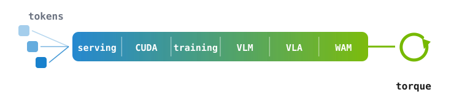
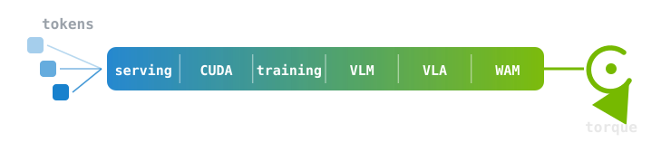

<div align="center">

# tokens → torque

**An embodied-AI stack from scratch — 72 days, 2 hours a day, on a Jetson.**

`serving` · `CUDA` · `training` · `VLM` · `VLA` · `WAM`

[](LICENSE)   

{.hero .light-content fig-alt="从 token 到扭矩：serving、CUDA、training、VLM、VLA、WAM 六个阶段，72 天"}
{.hero .dark-content fig-alt="从 token 到扭矩：serving、CUDA、training、VLM、VLA、WAM 六个阶段，72 天"}

</div>

> **"From scratch" 在这里的意思**：从零基础和一块空开发板开始，**不是**每个组件都重写一遍。
> 该用 vLLM 就用 vLLM，该部署 GR00T 就部署 GR00T——然后回头去读它的源码，把它拆开。
> 手写的部分（GPT、CUDA kernel、训练循环、projector）会明确标出来。

## 这是什么

tokens → torque 是一份 72 天的自学课表，覆盖六个方向：模型服务、CUDA、训练、VLM、VLA、WAM。每天两小时，跑一个实验，留下一个可以复现的数字。

课表面向已经在用这些模型、但对底下这一层只有二手知识的人：知道 vLLM 快，说不清快在哪；知道 LoRA 省显存，说不出省了多少、省在哪一项。每一天都从一个具体问题出发，跑出数字，再回头解释这个数字为什么是这样。

教程里的实测数字跑在一块 Jetson AGX Thor 上。大部分内容换任何一块 CUDA GPU 都成立，Jetson 特有的部分会标出来。

三条规矩：

1. **每天必须留下一个数字。** 概念看懂了但没测过，第二天就忘了。
2. **每天一个可复现的目录。** 别人 clone 下来照着 README 能跑通，否则不算写完。
3. **失败照记。** 装不上、跑崩了、结论被推翻——这些比成功的部分有用。

## 硬件：你需要什么

**大部分内容任何一块 CUDA GPU 都能跑。** 选 Jetson 是因为课表最后要落到机器人上，而边缘部署的那些约束（功耗墙、统一内存、无独显）正是要研究的东西。没有 Jetson 也能跟，见下表。

| 你有的 | 能跟到哪 |
|---|---|
| **Jetson AGX Thor / Orin**（32–128 GB 统一内存） | 全程。VLA 部署和大模型微调都在这一档 |
| **Jetson Orin Nano / NX**（8–16 GB） | Phase 1–4 基本完整；Phase 5–6 换小模型或只读不跑 |
| **任意 CUDA 独显**（≥ 12 GB） | Phase 1–3 完全没问题；Phase 4–6 看显存 |
| **只有 CPU / Mac** | 概念和源码阅读的部分都能跟，实验换成读别人的数字 |

Jetson 特有的内容（统一内存、功耗墙、`nvpmodel`、NVFP4 部署）会标 `[Jetson]`；只在 Thor 上验证过的数字标 `[Thor]`。

> [!WARNING]
> **先读安全规程**
>
> Jetson 到达热保护点是**硬件复位或关机，不是降频**。所有 GPU 任务都走 [`common/`](common/) 的四件套：预检、遥测、看门狗（自动优雅停）、优雅停止。看门狗的阈值**从内核读这块板子自己的 trip point**再留 30 °C 余量，不写死数字。细节见 [SETUP.md](SETUP.md#jetson-安全)。

## 进度

| Phase | 主题 | Days | 进度 |
|---|---|---|---|
| 0 | [Quickstart — 微调入门](days/day00_lora-quickstart/) | 00 | 1 / 1 |
| 1 | [Serving — 把模型跑起来并测准](days/day01_vllm-first-serve/) | 01–12 | 1 / 12 |
| 2 | CUDA — 从 kernel 到 profile | 13–24 | 0 / 12 |
| 3 | Training — 从零训到微调 | 25–36 | 0 / 12 |
| 4 | VLM — 把眼睛接上去 | 37–48 | 0 / 12 |
| 5 | VLA — 生成动作 | 49–60 | 0 / 12 |
| 6 | WAM — 世界动作模型 | 61–72 | 0 / 12 |
| | | **Total** | **2 / 73** |

<details open>
<summary><b>Phase 0 · Quickstart</b></summary>

| Day | 主题 | 产出 |
|---|---|---|
| [00](days/day00_lora-quickstart/) | 用 LoRA 微调一个 9B 模型 | adapter + 风格命中率 |

</details>

<details open>
<summary><b>Phase 1 · Serving</b></summary>

| Day | 主题 | 产出 |
|---|---|---|
| [01](days/day01_vllm-first-serve/) | 把模型变成一个服务 | `serve.sh` + 第一组延迟数字 + 浏览器客户端 |

</details>

<details>
<summary><b>Phase 1 · Serving</b>（day 01–12）</summary>

| Day | 主题 | 产出 |
|---|---|---|
| 01 | vLLM on Thor：第一条基线 | 启动脚本 + 首个延迟数字 |
| 02 | 一个请求在 vLLM 里的一生 | 请求路径图 |
| 03 | KV cache 到底占多少显存 | 手算 vs 实测，误差 < 15% |
| 04 | 连续批处理为什么快 | throughput–latency 帕累托曲线 |
| 05 | 可复现的 benchmark | `bench.sh`，三遍方差 < 5% |
| 06 | Thor 上的「可用工作点」 | 并发/延迟/温度三维结论 |
| 07 | 量化格式全景 | 格式 × 是否真加速 × 精度代价 |
| 08 | 在 Thor 上亲手量化一个模型 | 量化前后三项对比 |
| 09 | 投机解码 | accept rate → 实际加速比曲线 |
| 10 | 边缘多模型共存 | 干扰矩阵 |
| 11 | prefix caching：SGLang vs vLLM | 命中率 + TTFT 节省 |
| 12 | 边缘推理层需求清单 | 一页总结 |

</details>

<details>
<summary><b>Phase 2 · CUDA</b>（day 13–24）</summary>

| Day | 主题 | 产出 |
|---|---|---|
| 13 | CUDA 编程模型，`sm_110` 上跑通第一个 kernel | 实测带宽 / 理论带宽 |
| 14 | 内存层次：naive → tiled matmul | 两版 GFLOPS 与加速比 |
| 15 | Nsight 上手，profile day 01 的 vLLM | 前三热点 + 瓶颈类型 |
| 16 | reduction / scan / warp shuffle | 四版优化路径表 |
| 17 | Tensor Core 与 CUTLASS | 说清三层 tile 划分 |
| 18 | 把 matmul 推到 cuBLAS 的百分之几 | 一个数字 + 差距归因 |
| 19 | Triton 入门：fused softmax | 手写 CUDA vs Triton 的成本对比 |
| 20 | Triton matmul + autotune | 与 day 14 对比 |
| 21 | Flash Attention 原理 | 手推 online softmax |
| 22 | 改一个 attention kernel | 数值误差 < 1e-2 + 速度比 |
| 23 | Thor 的 roofline | roofline 图 + 关键算子定位 |
| 24 | Thor 上什么 memory-bound、什么 compute-bound | 指导后续所有优化的一页纸 |

</details>

<details>
<summary><b>Phase 3 · Training</b>（day 25–36）</summary>

| Day | 主题 | 产出 |
|---|---|---|
| 25 | tokenizer 与数据 | BPE + 切词结果 |
| 26 | **手写**一个 ~20M GPT | loss 从 ~10 开始下降 |
| 27 | 优化器与 lr sweep | loss 曲线族，找到炸掉的边界 |
| 28 | 混合精度与显存 | 显存–吞吐权衡表 |
| 29 | 评估与故意过拟合 | 让它模仿我说话 |
| 30 | 第一个会说人话的模型 | checkpoint + 全部超参 |
| 31 | LoRA 原理 | 手算加了多少参数 |
| 32 | Full SFT / LoRA / QLoRA 在 Thor 上实跑 | 三档显存/时间/效果 |
| 33 | 数据集构造与 loss mask | 干净的 SFT 数据集 |
| 34 | 微调到一个真实下游任务（自选） | vs 通用 LLM 的指标 |
| 35 | 可信的评测链（先用 GT 对 GT 闭环） | 评测脚本 |
| 36 | FSDP / ZeRO 原理与多卡实测 | scaling 效率 |

</details>

<details>
<summary><b>Phase 4 · VLM</b>（day 37–48）</summary>

| Day | 主题 | 产出 |
|---|---|---|
| 37 | VLM 架构谱系 | 三派对比图 |
| 38 | 拆一个真模型的 forward | 张量 shape 流水账 |
| 39 | 视觉 token 的代价 | token 数 → 延迟曲线 |
| 40 | **手训**一个 projector | 训练前后描述质量 |
| 41 | 空间关系 / 计数 / OCR 评测 | benchmark 分数 |
| 42 | Cosmos Reason2 在 Thor 上的可用性 | 延迟/显存/精度报告 |
| 43 | VLM 当感知前端 vs 传统检测管线 | 三项对比 |
| 44 | 结构化输出与 constrained decoding | 100% 合法 JSON + 开销 |
| 45 | 多帧输入与 KV 复用 | 帧数 → 效果/延迟 |
| 46 | VLM-as-judge（先验证评判器） | 可信自动评测器 |
| 47 | 控制回路里 VLM 的延迟预算 | 预算表 + 模型规模上限 |
| 48 | 给自己那个模型接上眼睛 | demo |

</details>

<details>
<summary><b>Phase 5 · VLA</b>（day 49–60）</summary>

| Day | 主题 | 产出 |
|---|---|---|
| 49 | VLA 谱系与三种动作头 | 谱系图 |
| 50 | π₀.₅ 上 Thor（TensorRT NVFP4） | 控制频率 + 温度曲线 |
| 51 | GR00T 1.7 上 Thor（混合 NVFP4） | 同上，对比 |
| 52 | 四个模型放同一 LIBERO 评测 | 成功率×频率×显存×功耗 |
| 53 | action chunking 与异步推理 | chunk 长度权衡曲线 |
| 54 | 边缘 VLA 的可行域 | 一张图 |
| 55 | LeRobot 数据格式 | 转换成功的小数据集 |
| 56 | 微调 GR00T N1.5/1.7 | loss 曲线 + rollout 视频 |
| 57 | 微调 SmolVLA / π₀.₅ | 两者对比 |
| 58 | 微调到底有没有用 | 哪些任务涨、哪些退 |
| 59 | 量化后的策略掉多少 | 精度–速度权衡 |
| 60 | 全流程可复现脚本 | `vla_finetune.sh` |

</details>

<details>
<summary><b>Phase 6 · WAM</b>（day 61–72）</summary>

| Day | 主题 | 产出 |
|---|---|---|
| 61 | 世界模型谱系，WAM 与 VLA 的本质差别 | 谱系图 |
| 62 | DreamZero 与 Cosmos Policy | 方法对比笔记 |
| 63 | 视频扩散基础 | 手推 flow matching 目标 |
| 64 | 跑一个小 world model | 预测帧 vs 真实帧 |
| 65 | 「想象」一次要多少毫秒 | 开销表 |
| 66 | WAM 在边缘可行吗 | 用数字回答 |
| 67 | WAM 的用法综述（读论文） | 一页笔记 |
| 68 | 用 world model 评策略（复现一篇） | 可行性结论 |
| 69 | WAM 的数据管线：视频怎么变成训练样本 | 一个能跑的转换脚本 |
| 70–71 | 最小闭环：感知 + VLA + WAM | 一段视频 |
| 72 | 收官与下一步 | 产出清单 + 3 个方向 |

</details>

## 怎么跟做

```bash
git clone https://github.com/enkerewpo/tokens-to-torque
cd tokens-to-torque
git config core.hooksPath .githooks   # 装隐私守卫（见下），只需一次
cat SETUP.md                           # 环境、依赖、Thor 安全四件套
cd days/day00_lora-quickstart && cat README.md
```

在线阅读：**<https://enkerewpo.github.io/tokens-to-torque/>**（公式、搜索、深色模式）

每一天的目录都是自洽的：`README.md`（教程）+ `code/`（能跑的代码）+ `results/`（数字和图）。没有 Thor 也能跟——大部分内容在任何 CUDA GPU 上都成立，Thor 特有的部分会标 `[Thor]`。

## 仓库结构

```
tokens-to-torque/
├── README.md                    # 你在这
├── ROADMAP.md                   # 72 天完整课表（每天的目标/动手/产出）
├── SETUP.md                     # 环境搭建 + Thor 安全规程
├── RESOURCES.md                 # 精选材料，每条线只挑一份主材料
├── AGENTS.md                    # 给 AI agent 的工作说明（CLAUDE.md 是它的软链接）
├── .claude/skills/              # day-start / day-wrap / privacy-check / thor-guard
├── site_src/                    # 文档站（Quarto）：模板与主题，内容是生成物
├── scripts/build_docs.py        # 从仓库 markdown 生成站点源码，自动排侧栏
├── appendix/                    # 附录：Transformer、线性代数、优化器、数值格式速查
├── templates/day.md             # 每日教程模板 = 质量标准
├── common/                      # 复用工具
│   ├── jetson_preflight.sh        #   跑前预检
│   ├── jetson_telemetry.sh        #   温度/功耗/内存遥测
│   ├── jetson_watchdog.sh         #   >=85C 自动优雅停
│   ├── jetson_stop.sh             #   优雅停止（永不 kill -9）
│   └── env.sh                   #   环境变量
└── days/
    └── dayNN_topic-name/
        ├── README.md            # 教程正文
        ├── code/                # 可跑代码
        ├── results/             # 数字、图、日志摘要
        └── private/             # 个人数据，gitignore，永不上传
```

> **仓库里只有验证过的 tutorial。** 个人流水账、聊天记录、语料、checkpoint 一律留在本地
> （`LOCAL.md` 和各天的 `private/`，都在 `.gitignore` 里，并且有 pre-commit hook 兜底）。

## 用 agent 跟做

这份课表默认你会开着 Claude Code 或 Codex 学。仓库里带了给 agent 的规矩：

- **[AGENTS.md](AGENTS.md)**（`CLAUDE.md` 是指向它的软链接，两边永远一致）—— agent 的角色是**陪跑助教**：先讲概念再动手，讲不清楚的地方要补进当天教程的 §2，而不是只在对话里说一遍。
- **`.claude/skills/`** 四个 skill：`day-start`（取任务、建目录、预检）、`day-wrap`（六节检查、构建站点、安全提交）、`privacy-check`（提交前扫个人数据）、`thor-guard`（Jetson 上跑任务的安全规程）。

### 本地记录 vs 公开仓库

跟着做的时候你会产生**只属于你自己**的东西：私人语料、聊天记录、SFT 数据集、checkpoint、粗糙的流水账。这些**不该进公开仓库**，所以：

| 放哪 | 什么 | 状态 |
|---|---|---|
| `days/dayNN_*/private/` | 语料、数据集、adapter、原始日志 | gitignore |
| `LOCAL.md` | 你的机器清单、私人流水账 | gitignore |
| `.git/private-patterns` | 你自己的私有关键词（主机名、项目代号…） | 在 `.git/` 里，不可能被提交 |
| 仓库其余部分 | **验证过的 tutorial** | 公开 |

`.githooks/pre-commit` 兜底：拦 `private/` 路径、`*.jsonl`、正文里的 IP 和邮箱，外加你自己那份关键词。clone 后执行一次 `git config core.hooksPath .githooks` 生效。

> 它拦不住你新写进正文的人名和内部术语——**agent 和你都要自己先判断一遍**。

## 每日教程的质量标准

`templates/day.md` 里定死了六节，缺一节这天就不算写完：

1. **为什么要学这个** — 一句话，接上前一天
2. **背景** — 最小必要理论，不抄文档
3. **动手** — 逐条命令，别人能复现
4. **结果** — 表格或图，必须有数字
5. **踩坑** — 装不上/跑崩了/结论被推翻的记录
6. **延伸** — 一到两个链接，不堆料

## 致谢

结构和写法参考了这几个学习型仓库：

- [rasbt/LLMs-from-scratch](https://github.com/rasbt/LLMs-from-scratch) — 章节化、`setup/`、可复用包、引用规范
- [elizabetht/100-days-of-inference](https://github.com/elizabetht/100-days-of-inference) — phase 分段与进度表
- [bikrammajhi/100-days-of-GPU](https://github.com/bikrammajhi/100-days-of-GPU) — 进度表当主导航、`dayNN_topic/` 命名
- [NVIDIA Jetson AI Lab](https://www.jetson-ai-lab.com/tutorials/) — Thor 上大部分实验的起点

## License

[MIT](LICENSE) · wheatfox
