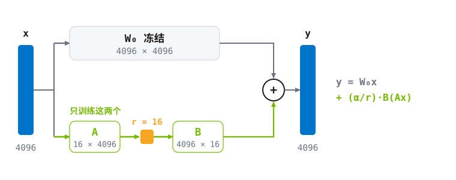
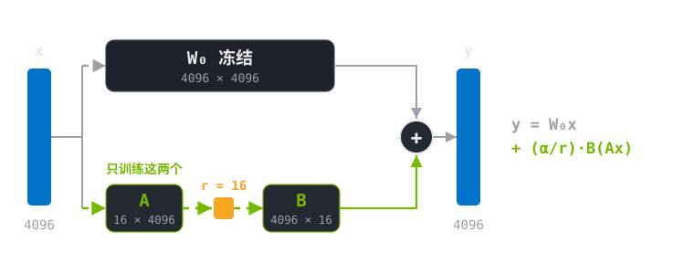
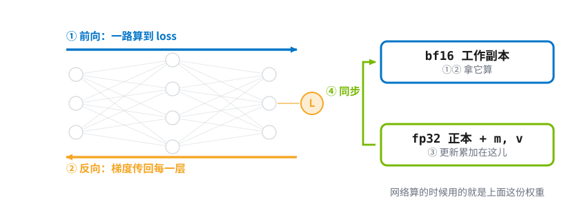
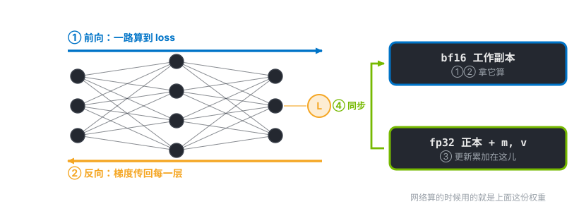
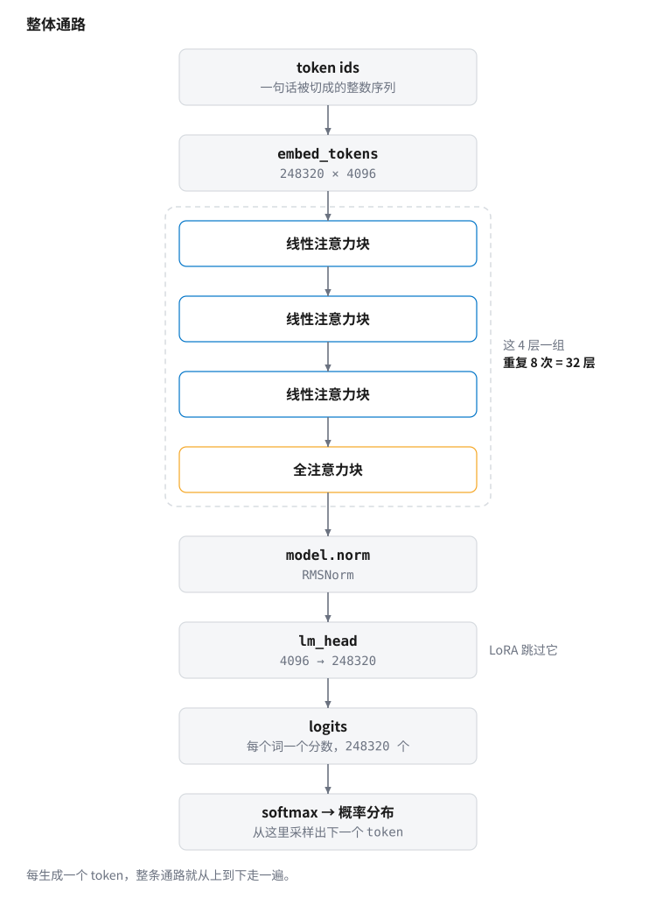
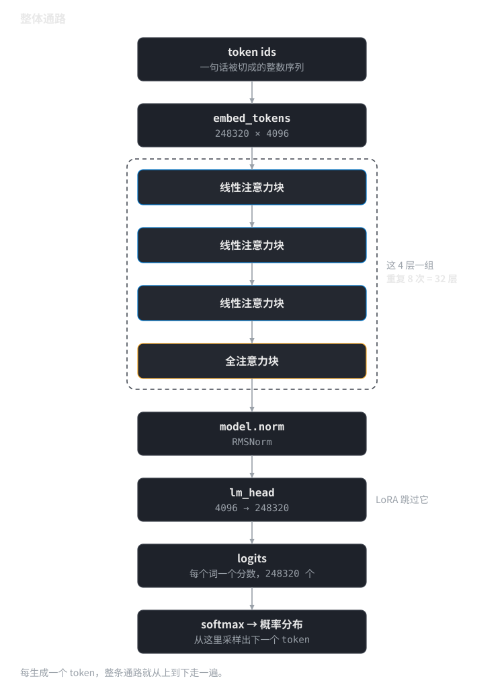
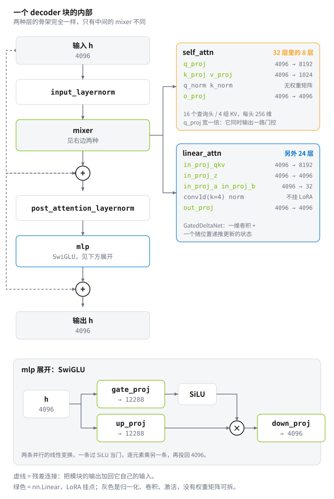
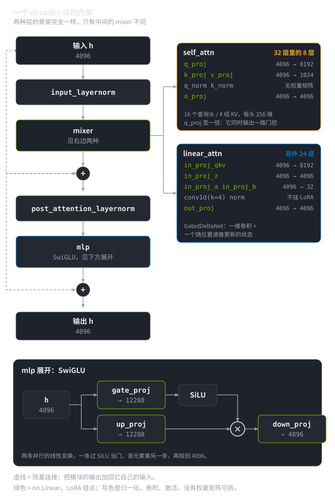
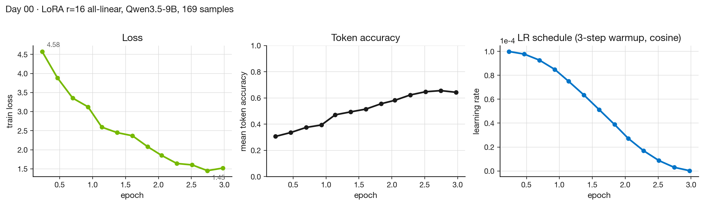

# Day 00 · 用 LoRA 微调一个 9B 模型

> **Phase** 0 · Quickstart
> **日期** 2026-09-__ · **机器** Jetson AGX Thor · **耗时** ~2h

这一天在一块 Jetson 上用 LoRA 微调 Qwen3.5-9B，让它换一套说话方式。全程约两小时，其中训练只占 4 分钟。

你会做这几件事：

- 准备数据集——仓库自带一份 169 条的演示数据，不需要你提供任何东西
- 把训练脚本读一遍：LoRA 挂在这个模型的哪些矩阵上、一段对话怎么变成 token、哪些位置才算 loss
- 跑一次 LoRA 微调
- 用一个能统计的指标验证微调确实生效，而不是靠感觉
- 和微调后的模型对话，随时切回原模型对比

跑完手上会有：一个 166 MB 的 adapter、一张训练曲线、一组 base 与微调后的对比数字。

**不需要先懂原理。** §2 解释了会用到的概念，但你也可以直接跳到 §3 开跑，回头再看。Phase 3（day 25–36）会把训练这条线从头拆一遍。

## 1. 为什么要学这个

微调是把通用模型改成自己需要的样子最直接的手段。读文章能知道 LoRA 是什么，但只有真训一次才知道：显存会涨到多少、loss 降到多少算正常、学习率高一点会发生什么、多少条数据才够。这些数字不自己撞一遍是记不住的。

## 2. 背景

### 2.1 `d_in` / `d_out` 是什么

Transformer 里绝大部分参数都在**线性层**里，而线性层就是一次矩阵乘法：

$$
\mathbf{y} = W\mathbf{x},
\qquad
\mathbf{x}\in\mathbb{R}^{d_{\text{in}}},\quad
W\in\mathbb{R}^{d_{\text{out}}\times d_{\text{in}}},\quad
\mathbf{y}\in\mathbb{R}^{d_{\text{out}}}
$$

$\mathbf{x}$ 是一个 token 的向量表示，$W$ 把它从 $d_{\text{in}}$ 维映射到 $d_{\text{out}}$ 维。

以 hidden size $d=4096$ 的模型为例，注意力里的 `q_proj`：

$$
W_q \in \mathbb{R}^{4096\times 4096}
\quad\Longrightarrow\quad
4096^2 = 16\,777\,216 \ \text{个参数}
$$

**一个矩阵就 1678 万参数。** 一层里有 `q/k/v/o` 四个，再乘几十层——这就是 “9B” 的来源。

微调就是把这些 $W$ 改一改。记改动量为 $\Delta W$，最终权重是 $W + \Delta W$。

### 2.2 LoRA 怎么表示 $\Delta W$：拆成 $BA$

微调要学的是改动量 $\Delta W\in\mathbb{R}^{d_{\text{out}}\times d_{\text{in}}}$。全参微调把它的每个元素都当自由参数，一个 $4096\times4096$ 的矩阵就是 1678 万个可训练参数。LoRA[^lora] 不直接学 $\Delta W$，而是把它约束成两个小矩阵的乘积（论文 §4.1）：

$$
W = W_0 + \Delta W = W_0 + BA,
\qquad
B\in\mathbb{R}^{d_{\text{out}}\times r},\quad
A\in\mathbb{R}^{r\times d_{\text{in}}},\quad
r\ll\min(d_{\text{in}},d_{\text{out}})
$$

{.fig .light-content fig-alt="LoRA 在一个线性层里的结构"}
{.fig .dark-content fig-alt="LoRA 在一个线性层里的结构"}

$W_0$ 冻结不动，只训练 $A$ 和 $B$。前向变成 $\mathbf{y} = W_0\mathbf{x} + \frac{\alpha}{r}B(A\mathbf{x})$：原来那条路照常算，旁边多一条“先把 $\mathbf{x}$ 压到 $r$ 维、再展开回 $d_{\text{out}}$ 维”的支路，两条相加。两路输出都是 $d_{\text{out}}$ 维，所以能逐元素相加。$\alpha/r$ 是缩放约定，§2.5 会讲。

| | 参数量 | 训练时每参数占 |
|---|---|---|
| $W_0$ 冻结 | $4096^2$ = 16.8 M | 2 字节（只存权重） |
| $A$ + $B$ 可训练 | $r(d_{\text{in}}+d_{\text{out}})$ = 131 072 | 16 字节（还要梯度、正本、$m$、$v$） |

图中省略了 bias；实际训练时挑哪些线性层挂 LoRA 是可配的，不是每层都挂。

**这样写，代价是什么。** 全参微调时 $\Delta W$ 的每个元素都能独立取值，训练结束它可以是任意一个 $4096\times4096$ 的矩阵。LoRA 只更新 $A$ 和 $B$，所以不管这两个小矩阵学成什么样，乘出来的 $\Delta W$ 的秩永远不超过 $r$（$B$ 只有 $r$ 列，见[附录 A.8](../../appendix/linear-algebra.md#a.8-矩阵乘积与列空间的包含)）；反过来，秩 $\le r$ 的矩阵也都能写成 $BA$（[附录 A.12](../../appendix/linear-algebra.md#a.12-秩分解定理与-svd)有证明）。

也就是说：**秩高于 $r$ 的那些 $\Delta W$，LoRA 根本表示不出来，训练再久也到不了。** 这和“近似”不是一回事——不是先算出真正的 $\Delta W$ 再拿低秩去逼近它，而是从头到尾只更新 $A$ 和 $B$，那些高秩的解从来没被碰过。

**凭什么这个限制不伤效果。** 这不是定理，是经验：Aghajanyan 等[^aghajanyan] 发现预训练模型微调时“有效的更新方向”远少于参数总数；LoRA 论文 §7 在 GPT-3 175B 上实测 $r=1,2$ 已接近 $r=64$。对一个新任务，$r$ 该取多少要自己测（day 31）。

> [!NOTE]
> 想知道“为什么秩 $\le r$ 就一定能拆成 $BA$”、SVD 怎么给出显式分解、以及“近似低秩”怎么用奇异值曲线量化，看[附录 A.12](../../appendix/linear-algebra.md#a.12-秩分解定理与-svd)。跑通 LoRA 不需要那些；day 31 做 $\Delta W$ 的 SVD 实验时会用到。
### 2.3 参数量：省在哪，什么时候不省

| | 参数量 | $4096\times4096,\ r=16$ |
|---|---|---|
| 全参 $\Delta W$ | $d_{\text{out}}d_{\text{in}}$ | $16\,777\,216$ |
| LoRA $A + B$ | $r(d_{\text{in}} + d_{\text{out}})$ | $16\times 8192 = \mathbf{131\,072}$ |
| 比值 | $\dfrac{r(d_{\text{in}}+d_{\text{out}})}{d_{\text{in}}d_{\text{out}}}$ | $\mathbf{0.78\%}$ |

**$r$ 为什么必须小**——把不等式解出来就知道了。要真的省参数，需要

$$
r\,(d_{\text{in}} + d_{\text{out}}) \;<\; d_{\text{in}}\,d_{\text{out}}
\quad\Longleftrightarrow\quad
r \;<\; \frac{d_{\text{in}}\,d_{\text{out}}}{d_{\text{in}} + d_{\text{out}}}
$$

方阵时 $d_{\text{in}}=d_{\text{out}}=d$，右边就是 $d/2$：

> [!WARNING]
> **临界点**
>
> $r$ 一旦到 $d/2$（这里是 **2048**），LoRA **一个参数都不省**。实践取 $r\in[8,64]$，相对 4096 是 $1/512 \sim 1/64$，才有意义。

反过来 $r$ 太小，$A$、$B$ 装不下足够的信息，效果会掉。所以 $r$ 是在“能学到多少”和“花多少显存”之间取舍，不是越小越好——day 31 用实验找这个平衡点。

### 2.4 真正省的是优化器状态

参数量省 99% 只是表面，**训练时显存的大头不是参数，是每个可训练参数背后跟着的一堆状态。** 先说清这堆状态是什么。

**AdamW 每个参数要存两个动量。** AdamW[^adam] 的更新不是直接用梯度 $g_t$，而是用梯度的两个指数滑动平均（为什么要这么做、每一项什么意思，见[附录 B · 优化器速查](../../appendix/optimizers.md)，有手算例子）：

$$
m_t = \beta_1 m_{t-1} + (1-\beta_1)\,g_t,
\qquad
v_t = \beta_2 v_{t-1} + (1-\beta_2)\,g_t^2,
\qquad
\theta_t = \theta_{t-1} - \eta\,\frac{m_t}{\sqrt{v_t}+\epsilon}
$$

$m$ 是梯度的平均（方向），$v$ 是梯度平方的平均（尺度）。它们是**逐参数**的：每个参数都有自己的 $m$ 和 $v$，训练全程保留，所以模型有多少可训练参数，就要多存两倍这么多的数。

**混合精度还要一份 fp32 正本。** 前向反向用 bf16 算得快，但 bf16 只有 7 位尾数、两三位有效数字（fp32/fp16/bf16 各是什么见[附录 C](../../appendix/numeric-formats.md)），一次更新 $\eta\,m/\sqrt v$ 常常小到加到 bf16 权重上直接被舍入成零。

所以标准做法（ZeRO 论文[^zero] §3）是**同一个参数存两份**：

- **fp32 正本**（论文里叫 master weights）——训练期间它才是这个参数的权威值，所有更新都累加在它身上，全程不降精度；
- **bf16 工作副本**——从正本复制出来的低精度版本，只用来算前向和反向，因为 bf16 矩阵乘快。每更新完一步，就从正本重新复制一份覆盖它。

换句话说，bf16 那份是「用完就可以扔、随时能从正本再生成」的，fp32 正本才是真正被训练的东西。

{.fig .light-content fig-alt="一步训练里 bf16 工作副本与 fp32 正本各自何时被用到"}
{.fig .dark-content fig-alt="一步训练里 bf16 工作副本与 fp32 正本各自何时被用到"}

先看一步训练里这些东西各自什么时候用到。设某个可训练参数是 $\theta$：

1. **前向**：用 $\theta$ 的 bf16 副本参与矩阵乘，算出 loss。bf16 走 Tensor Core，比 fp32 快得多。
2. **反向**：算出梯度 $g$，也是 bf16。
3. **更新**：把 $g$ 转成 fp32，更新 $m$ 和 $v$，算出更新量 $\eta\,\hat m/\sqrt{\hat v}$，**加到 $\theta$ 的 fp32 正本上**。
4. **同步**：把更新后的 fp32 正本转成 bf16，覆盖第 1 步用的那份工作副本，供下一轮前向。

第 3 步之所以必须在 fp32 正本上做，是因为更新量常常只有 $10^{-4}$ 量级，直接加到 bf16 上会被舍入成零（[附录 C](../../appendix/numeric-formats.md)）。

精度换算：bf16 是 16 位 = **2 字节**，fp32 是 32 位 = **4 字节**。逐项加起来：

| 存什么 | 什么时候用 | 精度 | 每个参数占 |
|---|---|---|---|
| $\theta$ 的 bf16 工作副本 | 步骤 1、2 算前向反向 | bf16 | 2 |
| 梯度 $g$ | 步骤 2 产出，步骤 3 消费 | bf16 | 2 |
| $\theta$ 的 fp32 正本 | 步骤 3 累加更新 | fp32 | 4 |
| Adam $m$ | 步骤 3，全程保留 | fp32 | 4 |
| Adam $v$ | 步骤 3，全程保留 | fp32 | 4 |
| **合计** | | | **16 字节** |

**冻结的参数只需要第一行的 2 字节。** 它不参与步骤 2–4：没有梯度、没有动量、不需要 fp32 正本——因为它根本不更新，bf16 那一份就是全部。

对 9B 模型，可训练参数 $N$：

| | 全参微调 $N = 9\times10^9$ | LoRA $N\approx2\times10^7$ |
|---|---|---|
| 冻结参数 × 2 B | 0 | $9\times10^9\times2$ = 18 GB |
| 可训练参数 × 16 B | $9\times10^9\times16$ = **144 GB** | $2\times10^7\times16$ = 0.3 GB |
| **合计（不含激活值）** | **~144 GB** | **~18.3 GB** |

一块 128 GB 统一内存的 Jetson AGX Thor 可用约 115 GB——**全参微调 9B 放不下，LoRA 剩一大半空间给激活值。** 24 GB 独显更是只有 LoRA/QLoRA 一条路。LoRA 省的就是这一块。90 亿个参数全部冻结，每个只占权重那 2 字节；额外那 14 字节只落在 4300 万个可训练参数头上。

> [!CAUTION]
> **一个常见误解**
>
> **LoRA 不减少反向传播的计算量。** 梯度仍然要穿过整个网络才能流到 $A$、$B$，中间激活值照样要存。所以 `gradient_checkpointing` 该开还得开。省的是**状态**，不是**算力**。
### 2.5 两个必须知道的实现细节

**初始化必须一零一随机**：$A\sim\mathcal{N}(0,\sigma^2)$，$B = 0$。

- 为什么 $B=0$：这样 $\Delta W = BA = \mathbf{0}$，**训练开始那一刻模型和原来完全一致**，预训练能力不会被随机噪声破坏。
- 为什么不能都取 0：梯度为

    $$
    \frac{\partial \mathcal{L}}{\partial B} = \boldsymbol{\delta}\,(A\mathbf{x})^{\!\top},
    \qquad
    \frac{\partial \mathcal{L}}{\partial A} = B^{\!\top}\boldsymbol{\delta}\,\mathbf{x}^{\!\top}
    $$

    两者会同时为零，**永远学不动**。取 $B=0$、$A$ 随机时，第一步 $\partial\mathcal{L}/\partial B \neq 0$，$B$ 先动；$B$ 一旦非零，$A$ 也开始收到梯度。

**`alpha` 是干什么的。** §2.2 写的 $\Delta W = BA$ 是简化版。实际实现里还会乘一个系数：

$$
\Delta W = \frac{\alpha}{r}\,BA
$$

$r$ 变大时 $BA$ 的数值幅度大致随之变大，除以 $r$ 把尺度稳住，**这样改 $r$ 之后不必把学习率整个重调一遍**（LoRA 论文的原话是 reduces the need to retune，不是完全免除）。$\alpha$ 才是真正的强度旋钮，习惯取 $\alpha = 2r$（我们用 $r=16,\ \alpha=32$）。

### 2.6 推理时零开销

训完可以把 adapter 合并回去：

$$
W' = W + \frac{\alpha}{r}BA
$$

得到一个和原模型**形状完全一样**的权重矩阵。所以 $A$、$B$ 只在训练时存在，**部署时没有额外矩阵乘法、没有额外延迟**。adapter 文件只有几十 MB，因为它只是 $A$ 和 $B$。

### 2.7 SFT 数据长什么样

一堆 `(user 说什么, assistant 回什么)` 对。关键在于：

**风格是从 assistant 那一侧学的。** 所以 response 必须是你的原文，instruction 只是给它上下文。`build_sft.py` 就是反推一个提示词套在原文前面。

还有个细节今天默认开着、day 33 细讲：`assistant_only_loss=True`—— **只对 assistant 的 token 算 loss**，否则模型会去学那些我们瞎编的 instruction 模板。

### 2.8 为什么几百条就够

不是在教新知识（那要几十万条），只是在改**说话风格**：用词习惯、句子长度、语气词、起头收尾。风格是很浅的模式。

而且由 §2.3，可训练参数只有约 $2\times10^7$ 个。**参数少，需要的数据也少**——几百条不至于欠拟合，还正好能让你亲手把每一条看一遍。

> [!TIP]
> **[Thor]**
>
> 122 GB 统一内存在这里是纯优势：4B 模型的 LoRA 微调在 24–32 GB 独显上要精打细算，在 Thor 上可以放开 batch。慢是慢（120 W 功耗墙），但塞得下。

### 2.9 这个模型长什么样

前面的 $d_{\text{in}}$、$d_{\text{out}}$ 一直是抽象符号。要知道 LoRA 到底挂在哪几个矩阵上、为什么加起来正好是 43.3 M 个参数，得先看看 Qwen3.5-9B 的结构。下面每个数字都来自模型自己的 `config.json`，用仓库里的工具几秒钟就能复现——它在 `meta` 设备上把模型搭出来，只建模块不读权重，所以不占显存也不用等加载：

```bash
python code/peek_model.py --model Qwen/Qwen3.5-9B --layer 3
```

| | 值 |
|---|---|
| decoder 层数 | 32 |
| 隐藏维度 $d_{\text{model}}$ | 4096 |
| FFN 中间维度 | 12288（SwiGLU，所以有 `gate` / `up` / `down` 三个矩阵） |
| 全注意力层 | 每 4 层一个，共 8 层（`full_attention_interval: 4`） |
| 线性注意力层 | 其余 24 层 |
| 全注意力的头 | 16 个查询头 / 4 个 KV 头（GQA），`head_dim` 256 |
| 词表大小 | 248320 |
| 最大位置数 | 262144 |

两个术语先说清楚再用：

- **全注意力层**（full attention）：标准 Transformer 的那种。每个 token 要和它前面所有 token 算一次注意力，计算量随序列长度平方增长，而且推理时要把每个历史 token 的 K、V 存下来（这就是 KV cache，day 03 专门算这笔账）。
- **线性注意力层**（linear attention）：把注意力改写成一个随时间递推的状态更新，计算量随长度线性增长，也不需要逐 token 保存 K、V。代价是表达能力比全注意力弱。

Qwen3.5 的做法是混着用：每 3 个线性注意力层配 1 个全注意力层。这天不需要理解线性注意力的数学，只需要知道**两种层里的线性层名字不一样**——下一段会看到，这直接决定了 LoRA 该怎么配。

先看整条路：一串 token id 进来，经过 embedding、32 个块、一次归一化，最后由 `lm_head` 投到词表上，得到每个词的分数（logits），softmax 成概率之后才采样出下一个 token。每生成一个 token 都要把这条路走一遍。

{.fig .light-content fig-alt="Qwen3.5-9B 的主干：token ids 经 embedding、32 个 decoder 块、RMSNorm、lm_head 得到 logits，再 softmax 成下一个 token 的概率分布"}
{.fig .dark-content fig-alt="Qwen3.5-9B 的主干：token ids 经 embedding、32 个 decoder 块、RMSNorm、lm_head 得到 logits，再 softmax 成下一个 token 的概率分布"}

再看一个块里面。

> [!NOTE]
> **下面这张图里出现的名词，先各给一句话**
>
> - **残差连接**：把一个模块的输出加回它自己的输入（图里的 ⊕）。这样梯度能顺着加法直接回到浅层，几十层的网络才训得动。
> - **归一化（RMSNorm）**：把一个向量按它自身的均方根缩放，让后面的层拿到的数值范围稳定。放在模块**之前**的叫 pre-norm，这个模型就是这样。
> - **mixer**：块里负责让不同位置的 token 互相看到对方的那个模块。前馈网络只在每个位置上各算各的，不做位置之间的交换，所以交换这件事全靠 mixer。
> - **分组查询注意力（GQA）**：多个查询头共用一组 K、V。这里 16 个查询头共用 4 组，KV cache 因此只有原来的四分之一（day 03 算这笔账）。
> - **RoPE**：把位置信息以旋转的形式写进 Q 和 K，模型才分得清 token 的先后。
> - **QK-Norm**：算注意力之前先把 Q、K 各归一化一次，训练更稳。
> - **SwiGLU**：前馈网络的一种。两条并行的线性变换，一条过 SiLU 当作“门”，逐元素乘到另一条上，再投回原来的维度。
> - **GatedDeltaNet**：线性注意力的一种具体实现，用一个随位置递推更新的状态，代替“每个 token 对所有历史 token 逐一算注意力”。这天不展开它的数学。

两种层的**骨架完全一样**，都是两段残差：先归一化、过 mixer、把结果加回输入；再归一化、过前馈网络、再加回一次。区别只在中间那个 mixer——全注意力块里是 `self_attn`（分组查询注意力，带 RoPE 和 QK-Norm），线性注意力块里是 `linear_attn`（一个叫 GatedDeltaNet 的模块：一维卷积加一个随时间递推的状态）。前馈网络两种块共用同一种：SwiGLU。

{.fig .light-content fig-alt="一个 decoder 块：输入先归一化再过 mixer，结果加回输入；再归一化过 SwiGLU 前馈网络，再加回一次。8 层用 self_attn，24 层用 linear_attn"}
{.fig .dark-content fig-alt="一个 decoder 块：输入先归一化再过 mixer，结果加回输入；再归一化过 SwiGLU 前馈网络，再加回一次。8 层用 self_attn，24 层用 linear_attn"}

图里绿色的名字就是 `nn.Linear`，灰色的是归一化、卷积和激活函数——后者没有权重矩阵可拆，LoRA 也就无从挂起。图在站点上可以点开放大。

**LoRA 挂在哪，是能数出来的。** `target_modules="all-linear"` 匹配除 `lm_head` 外的每一个 `nn.Linear`，一共 248 个：

| 层类型 | 每层的线性层 | 层数 | 每层几个 |
|---|---|---|---|
| 线性注意力 | `in_proj_qkv` `in_proj_z` `in_proj_a` `in_proj_b` `out_proj` + `gate_proj` `up_proj` `down_proj` | 24 | 8 |
| 全注意力 | `q_proj` `k_proj` `v_proj` `o_proj` + `gate_proj` `up_proj` `down_proj` | 8 | 7 |

每个线性层贡献 $r(d_{\text{in}} + d_{\text{out}})$ 个可训练参数（§2.3）。$r = 16$，所以“每个”那一列就是 $16\times(d_{\text{in}} + d_{\text{out}})$，逐项加起来：

| 模块 | 个数 | $d_{\text{in}} \to d_{\text{out}}$ | 每个 | 小计 |
|---|---|---|---|---|
| `gate_proj` `up_proj` | 64 | 4096 → 12288 | 262 144 | 16 777 216 |
| `down_proj` | 32 | 12288 → 4096 | 262 144 | 8 388 608 |
| `in_proj_qkv` | 24 | 4096 → 8192 | 196 608 | 4 718 592 |
| `in_proj_z` `out_proj` | 48 | 4096 → 4096 | 131 072 | 6 291 456 |
| `in_proj_a` `in_proj_b` | 48 | 4096 → 32 | 66 048 | 3 170 304 |
| `q_proj` | 8 | 4096 → 8192 | 196 608 | 1 572 864 |
| `k_proj` `v_proj` | 16 | 4096 → 1024 | 81 920 | 1 310 720 |
| `o_proj` | 8 | 4096 → 4096 | 131 072 | 1 048 576 |
| **合计** | **248** | | | **43 278 336** |

训练脚本启动时打印的是 `trainable params: 43,278,336`——和上面这一列加出来的数字一样。这不是巧合，是同一个公式的两种算法。

`lm_head` 是唯一被跳过的那个，所以是 248 不是 249。这不是我们配的，是 PEFT 的行为：展开 `all-linear` 时它先收集所有 `nn.Linear`，再把 `model.get_output_embeddings()`（也就是 `lm_head`）从名单里剔掉，源码注释写的是 “ignore the last classification head for text generation models”[^peftsrc]。

**注意别把理由记成“它太大了”。** LoRA 的开销是 $r(d_{\text{in}} + d_{\text{out}})$，和原矩阵多大无关——真挂上去也只多 $16 \times (4096 + 248320) \approx 4.0$ M 个参数，占 adapter 的 9%，不算多。跳过它的理由是它干的事和别的线性层不同：其余线性层都在 4096 维的隐空间里做变换，而 `lm_head` 是把隐状态投到 248320 个词上、直接决定每个词的分数。这天要改的是说话风格，风格来自中间层的表示；动输出头则会整体改变模型对所有 token 的打分。这是 PEFT 选的默认，不是定理——真要动它，显式写进 `target_modules` 或 `modules_to_save` 就行。

### 2.10 模型眼里的一段对话

模型不认识“角色”“轮次”这些概念，它收到的只是一串整数。把一段对话变成这串整数的规则叫 **chat template**，每个模型自带一份，存在 tokenizer 里。Qwen 用的是 ChatML 风格。下面的 id 和渲染结果都能复现：

```bash
python code/peek_tokens.py --model Qwen/Qwen3.5-9B
```

- `<|im_start|>`（id 248045）——一轮开始，紧跟角色名（`system` / `user` / `assistant`）
- `<|im_end|>`（id 248046）——一轮结束。**同时是这个模型的 `eos_token`**
- `<think>` / `</think>`（id 248068 / 248069）——思考段的边界
- `<|vision_start|>` / `<|image_pad|>`（id 248053 / 248056）——图像输入用；这个模型带一座 27 层的视觉塔，这天用不到
- `<|endoftext|>`（id 248044）——这天拿它当 pad

一条用户消息经过模板（`enable_thinking=False`）变成这样：

```text
'<|im_start|>user\n解释一下什么是 KV cache。<|im_end|>\n<|im_start|>assistant\n<think>\n\n</think>\n\n'
```

**thinking 是模板行为，不是模型的另一个开关。** `enable_thinking=True` 时模板只写一个 `<think>\n` 就停手，把思考内容留给模型自己生成；`False` 时模板直接把 `<think>\n\n</think>\n\n` 这个空思考段补完，模型接着写的就是正式回答：

```text
'<|im_start|>user\n解释一下什么是 KV cache。<|im_end|>\n<|im_start|>assistant\n<think>\n'
```

这天全程用 `enable_thinking=False`：几百条数据教不会推理，而思考段会把生成时间拖长好几倍。

切成 token 之后，上面那段提示是 18 个：

```text
<|im_start|> | user | \n | 解释 | 一下 | 什么是 |  KV |  cache | 。 | <|im_end|> | \n | <|im_start|> | assistant | \n | <think> | \n\n | </think> | \n\n
```

三件事记住就够了：

1. `add_generation_prompt=True` 负责在末尾补 `<|im_start|>assistant`。不补，模型不知道轮到自己说话。
2. **`\n\n` 是一个 token，不是两个。** 这条在 §3.3 会变成一个具体的 bug。
3. 训练时要自己在答案末尾加上 `<|im_end|>`。模型只有在数据里见过结束符，推理时才会停；不加它就会自己接着编下一轮 user 说了什么——day 00 第一版就是这么翻车的（§5）。

## 3. 动手

### 3.0 进容器（10 min）

容器是整个课表共用的，建法见 [SETUP](../setup.md#项目容器整个课表共用一个)。已经建好的话：

```bash
sudo docker exec -it -w "$PWD" t2t bash    # 容器内外同路径，进去还在当前目录
cd days/day00_lora-quickstart
bash code/setup_env.sh          # 装依赖，几分钟；中途别 Ctrl+C，装一半会留下缺包的环境
```

**下面所有命令都在容器里、在这个目录下敲。** 宿主机上没有 torch/peft/trl，在外面跑会 `ModuleNotFoundError`。

跑 GPU 任务前先过一遍安全检查（在宿主机上跑，不是容器里）：

```bash
bash common/jetson_preflight.sh   # 任何一项 FAIL 就别起跑
```

### 3.1 准备数据集（2 min）

仓库自带一份**演示数据集**，任何人 clone 下来都能直接用，不需要交出自己的任何数据：

```bash
python code/make_demo_dataset.py   # -> data/persona_demo.jsonl，169 条
```

这个文件本身就在仓库里，跑一遍脚本是为了看清它从哪来。脚本读的是仓库里的文档，所以条数会随文档增删小幅变化，它结束时会打印实际条数——本文的 169 条是写这天时的值。

它由两部分拼成，都在仓库里、都可复现：

- **本仓库文档里的中文段落**（附录 A/B/C、课表、SETUP 等）——真实技术散文；
- **`code/seeds.py` 里的中性问答种子**——覆盖课表话题和日常闲聊，让模型在聊天时也带着这套语气。

然后由 `code/stylize.py` 统一注入一组**明确且可统计**的风格标记：口癖开头（唔／诶／嗯…）、句尾 `～`、口癖结尾（……大概是这样吧～）。随机种子固定，所以**风格的真值已知**，训练效果可以直接量化。

> 为什么先用注入的风格而不是真实语料：真实语料的风格很浅（用词习惯、句子长度），微调完肉眼很难判断学没学到，容易自我欺骗。注入一组能数出来的标记，“有没有效果”就变成一个数字。等这条链路跑通了，再换成自己的语料（见 §6）。

### 3.2 看一眼数据（5 min）

```bash
python code/peek.py data/persona_demo.jsonl -n 3
```

**这一步别跳过。** 数据里有什么，模型就学什么；数据里没有的，训一万步也不会有。

### 3.3 训练脚本在做什么（先读，再跑）

`code/train_lora.py` 不到 120 行，真正干活的是四段。四个库各管一件事：

| 库 | 在这一天负责什么 |
|---|---|
| `transformers` | 加载 tokenizer 和 base 模型，提供 chat template |
| `peft` | 把 $A$、$B$ 插进选中的线性层，冻结其余参数 |
| `trl` | SFT 的训练循环（`SFTTrainer` / `SFTConfig`），是 `transformers.Trainer` 的封装 |
| `datasets` | 把一列 Python dict 变成 Trainer 能迭代的 `Dataset` |

**第一步：把一条对话变成 token 序列，外加一个 loss 掩码。**

先说清楚训练时在算什么。模型做的事从头到尾只有一件：给它一串 token，预测下一个。所以一条训练样本就是一串 token；模型在每个位置都给出一个“下一个 token 是什么”的预测，拿它和真实的下一个 token 比，就得到这个位置的损失（loss）。整条样本的损失是各位置损失的平均。

但我们不希望它在所有位置上都学。一条样本的前半段是提问，那是 §3.1 用固定模板合成出来的句子，学它没意义，还会让模型学会自己提问。要学的是后半段——助手的回答。所以需要一个和 token 序列等长的 0/1 数组，标出哪些位置算损失、哪些不算。这个数组就是**掩码**（mask），脚本里叫 `completion_mask`：回答部分是 1，其余是 0。

造这个数组只需要知道提问占了前多少个 token。做法是两段分别转换、再首尾相接：

```python
def encode(r):
    prompt_txt = tok.apply_chat_template(r["messages"][:-1], add_generation_prompt=True,
                                         enable_thinking=False, tokenize=False)
    ids_p = tok(prompt_txt, add_special_tokens=False)["input_ids"]
    ids_c = tok(r["messages"][-1]["content"] + tok.eos_token, add_special_tokens=False)["input_ids"]
    ids  = (ids_p + ids_c)[: a.max_seq]
    mask = ([0] * len(ids_p) + [1] * len(ids_c))[: a.max_seq]
    return {"input_ids": ids, "completion_mask": mask}
```

`messages[:-1]` 是提问那半边，先过 §2.10 的 chat template 变成带 `<|im_start|>` 标记的字符串，再转成 token 序列 `ids_p`；`messages[-1]` 是要学的回答，转成 `ids_c`。两段拼起来是整条样本，而 `len(ids_p)` 就是边界——掩码前 `len(ids_p)` 个位置写 0，后面写 1。回答末尾要自己加上 `tok.eos_token`（就是 §2.10 的 `<|im_end|>`），模型只有在数据里见过结束符，推理时才知道在哪停。

**为什么不让 TRL 自己找边界。**

TRL 也能接一整段对话、自己把提问和回答切开，它的办法是：把提问单独转成 token 得到序列 A，把“提问 + 回答”整段转成 token 得到序列 B，然后假设 **A 正好是 B 的前 `len(A)` 个 token**（这个关系叫“A 是 B 的前缀”）。假设成立的话，边界就是 `len(A)`，和我们手工拼出来的一样。

这个假设在这个模型上不成立，原因就在 §2.10 那张 token 切分里：分词器会把常见的字符组合并成一个 token，**两个换行 `\n\n` 在这个词表里是一个 token，不是两个**。而模板在两种场合写出的字符串结尾不一样：

| 模板渲染的是 | 结尾 |
|---|---|
| 只有提问，准备让模型接着写（TRL 这样渲染 A） | `…<think>\n` |
| 提问 + 回答的完整对话（B） | `…<think>\n\n</think>\n\n回答` |

于是 A 的第 15 个 token 是 `\n`，B 的第 15 个 token 是 `\n\n`，对不上，前缀假设当场失效。TRL 找不到边界，日志里出现 `Mismatch between tokenized prompt...`，掩码落到错误的位置上——day 00 第一版就是这样把生成搞坏的（§5）。

自己拼没有这个问题：边界是数出来的，不依赖任何假设。顺带一提，只要两边都固定 `enable_thinking=False`，前缀假设其实是成立的——这天的 169 条数据里 0 条不满足。可以自己验：

```bash
python code/peek_tokens.py --model Qwen/Qwen3.5-9B
```

**第二步：告诉 PEFT 把 LoRA 插在哪。**

```python
peft_cfg = LoraConfig(
    r=a.rank, lora_alpha=a.alpha, lora_dropout=0.05,
    bias="none", task_type="CAUSAL_LM",
    target_modules="all-linear",
)
```

| 参数 | 含义 |
|---|---|
| `r` | 低秩分解的秩，决定 $A$、$B$ 的形状（§2.2）。这天用 16 |
| `lora_alpha` | 缩放系数，前向时加的是 $\frac{\alpha}{r}BAx$（§2.5）。习惯取 $2r$，这天 32 |
| `lora_dropout` | 只作用在 LoRA 旁路上的 dropout，小数据集上防过拟合 |
| `bias` | 要不要一起训 bias。`"none"` = 不训，adapter 里只有 $A$、$B$ |
| `task_type` | 告诉 PEFT 这是因果语言模型，保存时才知道该带上哪些层 |
| `target_modules` | 挂到哪些模块。`"all-linear"` = 除 `lm_head` 外所有 `nn.Linear`，也就是 §2.9 数出来的 248 个 |

别的教程里这一项通常写成 `["q_proj","k_proj","v_proj","o_proj"]`。在这个模型上照抄会踩坑，原因见 §5 第 1 条。

**第三步：训练参数和 Trainer。**

```python
cfg = SFTConfig(output_dir=a.out, num_train_epochs=a.epochs,
                per_device_train_batch_size=a.batch, gradient_accumulation_steps=2,
                learning_rate=a.lr, lr_scheduler_type="cosine", warmup_steps=3,
                bf16=True, gradient_checkpointing=True,
                max_length=a.max_seq, completion_only_loss=True)

trainer = SFTTrainer(model=model, args=cfg, train_dataset=ds,
                     processing_class=tok, peft_config=peft_cfg)
trainer.model.print_trainable_parameters()
trainer.train()
```

几个非默认值的理由：

- `gradient_accumulation_steps=2`：显存只够 batch 4，但想要 batch 8 的梯度，就攒两个 mini-batch 再更新一次。§4 里 43 个 mini-batch 变成 22 个优化步就是这么来的
- `gradient_checkpointing=True`：前向时不保留全部中间激活值，反向时重算。省显存，换约 20–30% 的时间
- `warmup_steps=3`：总共才 66 步，按比例算 warmup 已经没意义；另外 transformers 5.x 去掉了 `warmup_ratio`
- `completion_only_loss=True`：让 Trainer 用上面那个 `completion_mask`

`peft_config` 传进 `SFTTrainer` 之后，它内部替你调 `get_peft_model()` 把模型包起来。这一行打印的就是这天的第一个数字：

```text
trainable params: 43,278,336 || all params: 8,997,081,600 || trainable%: 0.4810
```

和 §2.9 手算的 43 278 336 对上了。

**第四步：保存。** `trainer.save_model()` 只写 adapter，不写 base 模型——目录里就两个关键文件：`adapter_config.json`（挂了哪些层、$r$ 多少）和 `adapter_model.safetensors`（166 MB 的 $A$、$B$）。

166 MB 这个数也能对上账：$43\,278\,336 \times 4\ \text{字节} = 173\ \text{MB}$，PEFT 默认按 fp32 存 adapter，而训练时权重是 bf16。

### 3.4 微调（40–60 min）

另开一个终端起遥测和看门狗：

```bash
nohup bash ../../common/jetson_telemetry.sh &        # 日志落在仓库 logs/
nohup bash ../../common/jetson_watchdog.sh 'train_lora' 85 &
```

然后训：

```bash
python code/train_lora.py \
    --model Qwen/Qwen3.5-9B \
    --data data/persona_demo.jsonl \
    --out private/adapter \
    --epochs 3 --rank 16 --batch 4 --lr 1e-4
```

> **模型选型和 wheel 版本以 [Jetson AI Lab «Fine-tune LLMs on Jetson»](https://www.jetson-ai-lab.com/tutorials/finetune-on-jetson/)
> 为准**——那篇给了 Thor 上验证过的 Full SFT (4B) / LoRA (9B) / QLoRA (27B) 三档配置。
> 本仓库的脚本是通用 TRL + PEFT 写法，具体版本 pin 见 [踩坑](#5-踩坑)。

### 3.5 对比（20 min）

```bash
python code/compare.py \
    --model Qwen/Qwen3.5-9B --adapter private/adapter \
    --prompts code/prompts.txt \
    --out private/before_after.md
```

### 3.6 量一下到底学到没有，以及有没有学过头

```bash
python code/measure_style.py --model Qwen/Qwen3.5-9B --adapter private/adapter --prompts code/prompts.txt
```

它做两件事：

1. **风格命中率**——同一批问题分别用 base 和 adapter 生成，数风格标记出现了几次。这是这天要留下的数字。
2. **知识保持**——再问几个和训练语料完全无关的事实问题（`code/probes.txt`），看 adapter 还答不答得上来。

第二项是必须的。风格学到了不等于成功：样本少、轮数多的时候，模型会开始**背语料**——你问它“网易是什么公司”，它拿训练集里的句子来答。只看风格命中率发现不了这件事。

判定用的是关键词匹配，只是个近似。模型答“中华人民共和国的首都”而关键词写的是“中国”，就会被算成没答对。加 `--out results.json` 把每条原文存下来，标 ✗ 的先自己看一眼是真忘了还是换了个说法——这天的 `probes.txt` 就是这么调出来的。

> 以上串起来就是 `bash code/run_all.sh`，跑完直接进 3.8。

### 3.7 推理这边：adapter 怎么挂上去、怎么切回 base

`compare.py`、`measure_style.py`、`chat.py` 三个脚本共用 `code/_common.py` 里的三个函数。先是加载：

```python
base  = AutoModelForCausalLM.from_pretrained(model_id, dtype=torch.bfloat16,
                                             device_map="cuda").eval()
model = PeftModel.from_pretrained(base, adapter).eval()
```

`PeftModel.from_pretrained` 把 adapter 挂到**已经加载好的** base 上，不是再加载一个 9B。内存里始终只有一份 18 GB 的权重，外加 43 M 个 LoRA 参数。

然后是这天所有对照实验的基础：

```python
with model.disable_adapter():
    answer_base = generate(prompt)
answer_lora = generate(prompt)
```

`disable_adapter()` 是个上下文管理器，进去时关掉 LoRA 旁路、出来再打开。§4 那张 base vs adapter 的表就是这么来的：同一个进程、同一份权重、同一个随机种子，唯一的变量是那 43 M 个参数参不参与前向。`chat.py` 里的 `/base` 和 `/lora` 也是这一行。

最后是把消息变成张量、以及让它停下来：

```python
def render(tok, messages, device):
    return tok.apply_chat_template(messages, add_generation_prompt=True,
                                   enable_thinking=False, return_tensors="pt",
                                   return_dict=True).to(device)

def stop_ids(tok):
    return list({tok.convert_tokens_to_ids("<|im_end|>"), tok.eos_token_id})
```

两个参数都在 §2.10 讲过了：`add_generation_prompt=True` 补上 `<|im_start|>assistant`，`enable_thinking=False` 让模板把空思考段写完。`stop_ids` 要显式传给 `generate(eos_token_id=...)`——不传，模型说完一轮会继续往下编下一轮的 user 发言。

### 3.8 和它聊天

```bash
python code/chat.py --model Qwen/Qwen3.5-9B --adapter private/adapter
```

流式输出、多轮记忆、已关 thinking。`/base` 切到原模型、`/lora` 切回 adapter，同一个问题两边各问一遍最能看出差别；`/reset` 清空对话，`/quit` 退出。

## 4. 结果

Jetson AGX Thor（120 W），Qwen3.5-9B bf16，LoRA r=16、α=32、`all-linear`，cosine + 3 步 warmup，batch 4 × 累积 2，3 epoch、lr 1e-4——就是 §3.4 那条命令，数据是仓库自带的 169 条。

| | 值 |
|---|---|
| 可训练参数 / 总参数 | 43.3 M / 8.997 B = **0.48%** |
| 训练步数 | 66 步（169 条按 batch 4 分成 43 个 mini-batch，累积 2 步更新一次 → 每 epoch 22 步） |
| 训练耗时 | **4.0 min** |
| 峰值内存 | **23.6 GB** |
| tj 温度 | 起 38 °C → 终 **51 °C** |
| train loss | **4.58 → 1.52** |
| token 准确率[^acc] | 0.31 → 0.64 |
| adapter 文件 | 166 MB |

对照 §2.4：权重 18 GB + 43 M × 16 B ≈ 0.7 GB，其余约 5 GB 是激活值和 CUDA 工作区。数字和推算对得上。



### 效果：风格标记命中率

同一批 8 个问题（`code/prompts.txt`），base 与 adapter 各生成一次：

| 标记 | base | + adapter |
|---|---|---|
| 句尾 `～` | 0 / 8 | **8 / 8** |
| 口癖开头（唔／诶／嗯…） | 0 / 8 | **8 / 8** |
| 口癖结尾（……大概是这样吧～） | 0 / 8 | **5 / 8** |

再问 12 个和训练语料完全无关的常识题（`code/probes.txt`）：base 答对 12 / 12，adapter 也是 **12 / 12**。语气换掉了，知识没跟着掉。

**169 条样本、4 分钟、0.48% 的参数，足以让 9B 模型换一套说话方式。**

> [!IMPORTANT]
> **这不是 prompt 工程，风格完全来自微调后的权重**
>
> `measure_style.py` 会先把真正送进模型的完整提示打印出来。base 和 adapter 收到的是**逐字节相同**的输入：
>
> ```
> '<|im_start|>user\n解释一下什么是 KV cache。<|im_end|>\n<|im_start|>assistant\n<think>\n\n</think>\n\n'
> ```
>
> 没有 system prompt，没有“请用可爱语气回答”这类指令，没有 few-shot 示例。两次生成唯一的差别是 `model.disable_adapter()` 开还是关——也就是那 43 M 个 LoRA 参数加不加进去。`chat.py` 里的 `/base` 和 `/lora` 切换同理，你可以自己验。

### 换学习率：这份数据上三档都学得会

同一份数据、同样 3 epoch，只改学习率各训一次，再用同一批问题量一遍：

| lr | 句尾 `～` | 口癖开头 | 口癖结尾 | 常识 12 题 | 耗时 |
|---|---|---|---|---|---|
| 5e-5 | 7 / 8 | 8 / 8 | 4 / 8 | 11 / 12 | 3.7 min |
| **1e-4**（§3.4 那条命令） | 8 / 8 | 8 / 8 | 5 / 8 | **12 / 12** | 4.0 min |
| 2e-4 | 8 / 8 | 8 / 8 | 4 / 8 | 12 / 12 | 3.7 min |
| base（不加 adapter） | 0 / 8 | 0 / 8 | 0 / 8 | 12 / 12 | — |

三档都把风格学了过去，彼此差一两次命中，8 个问题的样本量撑不起更强的说法。所以这天不要带走“学习率越大越容易过拟合”这个结论——在这份 169 条、风格标记明确的数据上，它没显出来。

换个条件就会显出来：语料更少、话题更集中时（比如你自己写的一两百条，见 §6），同样 3 epoch、lr 2e-4，模型会开始逐字复述训练集，问一个无关的事实问题也拿语料里的句子来答。这是本仓库作者在自己语料上的一次观察，不是定理——决定会不会过拟合的是数据量、数据多样性、可训练参数量、轮数、学习率一起作用，不是学习率一个钮。day 31 会取足够多的配置点，把这条曲线正经扫一遍。

## 5. 踩坑

环境和版本问题都已经写进 `code/setup_env.sh` 和 `common/env.sh`，照跑即可。只有两件事值得知道原理：

1. **LoRA 挂在哪要看模型结构，不要照抄 `q_proj,k_proj,v_proj,o_proj`。** Qwen3.5-9B 是混合架构：32 层里 24 层是线性注意力（模块叫 `in_proj_qkv` / `out_proj`），只有 8 层有 `q/k/v/o_proj`。照抄只覆盖 **3.9 M（0.04%）** 参数；`target_modules="all-linear"` 是 **43.3 M（0.48%）**。查法：`AutoModelForCausalLM.from_config(cfg)` 在 meta 设备上建空模型，列 `nn.Linear` 的名字和形状，不用等权重。
2. **只对 assistant 算 loss 有两条路。** `assistant_only_loss=True` 要求 chat template 带 `` 标记，Qwen3.5 没有；改成 prompt/completion 格式，TRL 默认 `completion_only_loss=True`，不依赖模板。

## 6. 延伸

跑通之后，把演示数据集换成**你自己的语料**，这条支线会一直走到 day 72：

```bash
# 同样在容器里跑
python code/collect_corpus.py --git ~/Code/your-repo --author-email "$(git config user.email)" \
    --markdown ~/notes --out private/corpus.jsonl
python code/build_sft.py --in private/corpus.jsonl --out private/sft.jsonl --min-chars 40
python code/add_batch.py private/paste_*.txt      # 手动粘贴的聊天记录，自动合并连续消息
```

个人语料一律放 `private/`（已 gitignore），**不要进仓库**。

两个链接：

- [LoRA 论文](https://arxiv.org/abs/2106.09685)：§4.1 是 $\Delta W = BA$ 这个写法的出处，§7 是低秩假设的实验证据
- [Jetson AI Lab — Fine-tune LLMs on Jetson](https://www.jetson-ai-lab.com/tutorials/finetune-on-jetson/)

**明天要回答的问题**：这个 adapter 到底改了模型的什么？`r=16` 是多少个参数，凭什么够？→ day 31。

<!-- 参考文献用脚注 [^key] 写在这里，站点会自动汇总到文末的「参考文献」区 -->

[^acc]: 在算 loss 的那些位置上，模型概率最高的那个 token 恰好等于真实下一个 token 的比例。它比 loss 直观，但只看它会漏掉“对的很勉强”这种情况，两个一起看。
[^peftsrc]: PEFT 0.20.0 源码 `src/peft/tuners/tuners_utils.py` 的 `_maybe_include_all_linear_layers()`：[GitHub](https://github.com/huggingface/peft/blob/main/src/peft/tuners/tuners_utils.py)。判断依据是 `model.get_output_embeddings()`，注释原文 “ignore the last classification head for text generation models”。
[^lora]: Hu, E. J. et al. "LoRA: Low-Rank Adaptation of Large Language Models." [*ICLR* 2022](https://openreview.net/forum?id=nZeVKeeFYf9). [arXiv:2106.09685](https://arxiv.org/abs/2106.09685). §4.1 是 $\Delta W = BA$ 这个写法的出处，§7 是低秩假设的实验证据。
[^aghajanyan]: Aghajanyan, A., Zettlemoyer, L. & Gupta, S. "Intrinsic Dimensionality Explains the Effectiveness of Language Model Fine-Tuning." [*ACL* 2021](https://aclanthology.org/2021.acl-long.568/). [arXiv:2012.13255](https://arxiv.org/abs/2012.13255).
[^adam]: Loshchilov, I. & Hutter, F. "Decoupled Weight Decay Regularization." [*ICLR* 2019](https://openreview.net/forum?id=Bkg6RiCqY7). [arXiv:1711.05101](https://arxiv.org/abs/1711.05101)（AdamW；Adam 本身见 Kingma & Ba, [*ICLR* 2015](https://openreview.net/forum?id=8gmWwjFyLj), [arXiv:1412.6980](https://arxiv.org/abs/1412.6980)）。详细推导见[附录 B](../../appendix/optimizers.md)。
[^zero]: Rajbhandari, S. et al. "ZeRO: Memory Optimizations Toward Training Trillion Parameter Models." [*SC* 2020](https://doi.org/10.1109/SC41405.2020.00024). [arXiv:1910.02054](https://arxiv.org/abs/1910.02054). §3 的混合精度 Adam 内存账：每参数 16 字节。
