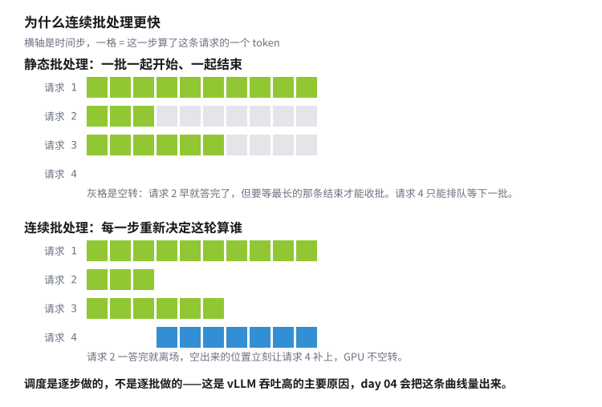
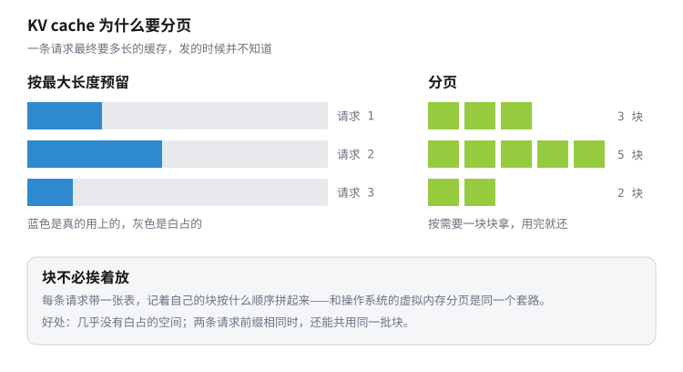

# Day 01 · 把模型变成一个服务

> **Phase** 1 · serving
> **日期** 2026-09-05 · **机器** Jetson AGX Thor · **耗时** ~2h

把 day 00 中运行一次即退出的脚本，换成一个常驻的 HTTP 服务。权重只加载一次，之后通过 `curl` 或浏览器发送请求。本节结束时，手上会有一条可复现的启动命令，以及这块板子上的第一组延迟数字。

你会做这几件事：

- 用 NGC 的 vLLM 容器启动一个 OpenAI 兼容的服务
- 逐个理解启动命令中的参数
- 用 `curl` 发出第一个请求，确认请求和响应的格式
- 把 day 00 训练的 adapter 挂载到服务上
- 测量 TTFT、TPOT 和端到端延迟，并与 `transformers.generate` 对比
- 用一个单文件的浏览器客户端聊天

## 1. 为什么要学这个

day 00 的 `chat.py` 每次运行都要重新加载 18 GB 权重，耗时约 40 秒，并且一次只服务一个请求。实际部署中的用法相反：模型常驻在机器上，请求陆续到达，由服务决定处理顺序，以及哪些请求可以合并计算。

这个服务是 Phase 1 后续五天的实验平台。day 02 读它的源码，day 03 计算它的 KV cache 占用，day 04 测量并发下的吞吐，day 05 建立可复现的 benchmark。因此目标不只是启动成功，还包括启动过程可复现，以及每个参数的含义清楚。

## 2. 背景

### 2.1 一次 `generate` 与一个服务的区别

day 00 的脚本按顺序做四件事：启动进程、加载权重、回答一个问题、退出。其中加载权重约 40 秒，回答约几秒。

服务把加载和回答分开：

| | day 00 的脚本 | 一个 serving 服务 |
|---|---|---|
| 权重加载 | 每次运行一遍 | 启动时一次，之后常驻内存 |
| 请求来源 | 命令行参数 | HTTP 请求，随时到达 |
| 同时处理的请求数 | 一个 | 多个，服务自行排队与合并 |
| 结束 | 回答完毕即退出 | 持续等待下一个请求 |

其中“多个请求合并计算”称为**批处理**（batching）。GPU 一次只处理一个请求时，矩阵乘法的一边很窄，大部分算力闲置。把多个请求的 token 合并成一个更大的矩阵一起计算，耗时几乎不变，吞吐成倍增加。vLLM 采用的方案称为**连续批处理**（continuous batching），§2.5 说明其原理，day 04 测量其效果。

### 2.2 OpenAI 兼容 API

**OpenAI 兼容**（OpenAI-compatible）指一组约定的 HTTP 接口：路径、请求体字段和响应格式与 OpenAI 的 API 相同。本节用到三个端点：

| 端点 | 作用 |
|---|---|
| `GET /health` | 存活检查。返回 200 表示服务就绪 |
| `GET /v1/models` | 列出服务加载的模型 |
| `POST /v1/chat/completions` | 对话接口 |

几乎所有推理引擎都实现这套接口，原因在于客户端生态。官方 `openai` SDK、各类聊天前端和 agent 框架都按这套协议编写。服务端只要接口一致，客户端改一个 `base_url` 即可切换，代码无需修改。这是事实标准，不是技术上的必然。

请求体中会用到的字段：

```json
{
  "model": "Qwen/Qwen3.5-9B",
  "messages": [{"role": "user", "content": "用三句话解释什么是 KV cache。"}],
  "max_tokens": 128,
  "temperature": 0,
  "stream": true
}
```

`messages` 是[附录 D.1](../../appendix/transformer.md) 描述的对话列表。服务端用模型自带的 chat template 把它拼成 token 序列，该模板见 day 00 §2.10。`stream: true` 要求服务端在生成过程中持续返回，而不是生成完毕后一次返回。§2.3 说明测量延迟为什么必须开启它。

### 2.3 延迟的三个指标

设一个请求生成了 $N$ 个 token，定义：

- **TTFT**（time to first token）：从发出请求到收到第一个 token 的时间。
- **TPOT**（time per output token）：第一个 token 之后，平均每生成一个 token 的时间。其倒数即常说的每秒 token 数。
- **端到端延迟**（end-to-end latency）：从发出请求到收到全部输出的时间。

三者的近似关系：

$$
\text{E2E} \;\approx\; \text{TTFT} + \text{TPOT} \times (N - 1)
$$

三个指标由不同的因素决定（[附录 D.8](../../appendix/transformer.md)）。TTFT 主要消耗在 prefill 阶段：整段提示一次计算完成，是大矩阵乘法，受算力限制。TPOT 消耗在 decode 阶段：每步只计算一个新位置，是矩阵乘向量，计算量小而读取量大，受内存带宽限制。因此提示越长，TTFT 越大，而 TPOT 基本与提示长度无关。

测量 TTFT 必须开启 `stream: true`。不开启时，服务端等整段生成完毕后一次返回。客户端收到第一个 token 的时刻等于收到最后一个 token 的时刻，测得的 TTFT 等于端到端延迟。

### 2.4 `--gpu-memory-utilization` 在统一内存上的含义

在独显上，这个参数是显存的比例。`0.9` 表示 vLLM 最多使用 90% 的显存，其余留给别的进程。

Thor 采用**统一内存**（unified memory）：CPU 和 GPU 共用同一块 122 GB 内存。这个比例划分的是整块共享内存的一部分。本节取 `0.30`，约 36 GB，容纳 18 GB 权重、KV cache 和工作区，并留有余量。

> [!WARNING]
> **[Thor] 这个参数划分的是整块系统内存**
>
> 其余容器、页缓存和 ssh 会话都在同一块内存里。取值过大时，系统内存耗尽，这些进程会被终止。

vLLM 取得这块内存后，先放权重，其余全部分配给 KV cache。启动日志因此会打印一行 KV cache 可容纳的 token 数。这个数决定了服务能同时处理的请求长度和数量，day 03 用公式计算它。

### 2.5 vLLM 的四项加速来源

§4 的测量结果：单请求快 1.6 倍，首 token 快 3.3 倍。原因有四项。前三项是 serving 引擎的核心机制，第四项与 serving 无关。

**连续批处理**（continuous batching）。GPU 一次只计算一个请求时，矩阵形状很窄，算力大部分闲置。把多个请求的 token 合并成一个更大的矩阵一起计算，耗时几乎不变，吞吐成倍增加。

早期的做法是静态批处理（static batching）：凑齐一批请求一起开始，一起结束。各请求的生成长度不同。先完成的请求必须等待批内最长的请求结束，才能释放位置。期间新到的请求只能等待下一批。

vLLM 在每一步重新决定本轮计算哪些请求。已完成的请求立即退出，空出的位置由等待中的请求填补。

<picture>
  <source media="(prefers-color-scheme: dark)" srcset="../../site_src/assets/fig-batching-dark.svg">
  
</picture>

day 04 把并发从 1 增加到 64，测量吞吐的增长和延迟的代价。

**分页的 KV cache**（PagedAttention）。[附录 D.8](../../appendix/transformer.md) 说明了模型为避免每步重算，要保存每个 token 的 K、V。这块缓存随生成长度增长。一条请求最终生成多少 token，在请求到达时并不知道。用户可能只问一句，也可能要求写两千字。

按最大长度为每条请求预留一整块缓存，是最简单的做法，也最浪费。绝大多数请求用不到预留的长度，空置的部分其他请求也无法使用。

vLLM 将缓存划分为固定大小的块（block），按需分配给请求。同一请求的块在物理内存中不必连续，请求持有一张块表（block table）记录各块的顺序。这与操作系统的虚拟内存分页是同一思路，该机制因此称为 PagedAttention[^paged]。

<picture>
  <source media="(prefers-color-scheme: dark)" srcset="../../site_src/assets/fig-paged-dark.svg">
  
</picture>

这台机器上的实际数字来自启动日志：

```text
Setting attention block size to 528 tokens        ← 一块存 528 个 token 的 K、V
GPU KV cache size: 879,130 tokens                 ← 总共能存这么多
Maximum concurrency for 8,192 tokens per request: 107.32x
```

最后一行的含义是：若每条请求都占满 8192 个 token，缓存可同时容纳 107 条。块大小 528 是这个模型特有的。它是混合注意力结构（day 00 §2.9），vLLM 要把全注意力层的页大小对齐到线性注意力层的页大小，因此取了这个值。纯注意力模型的块大小通常是 16。day 03 用公式核对这几个数。

**prefill 与 decode 混合调度**。[附录 D.8](../../appendix/transformer.md) 指出，prefill 受算力限制，decode 受内存带宽限制。一批中只有 decode 时算力闲置，只有 prefill 时带宽闲置。vLLM 的调度器把两类计算放进同一步。它还能把长提示的 prefill 切成多段，分几步完成，称为分块预填充（chunked prefill），避免一条长请求阻塞其他请求。day 04 观察它对延迟分布的影响。

**编译与图捕获**。启动日志中的 `torch.compile took 55.93 s` 和随后的 CUDA graph 捕获，把每步 decode 的算子融合，并预先录制 kernel 启动序列。这与批处理无关，只是把同一份计算做得更快。单请求（batch=1）也能快 1.6 倍，原因在此。

### 2.6 vLLM 的两种用法

vLLM 有两种用法：在 Python 进程内批量生成，或启动一个常驻服务。区别在于是否经过 HTTP。

| | 离线批量 | 在线服务 |
|---|---|---|
| 入口 | Python 中 `LLM(...)`，然后 `llm.generate([...])` | 命令行 `vllm serve <模型>` |
| 调用方 | 同一进程内的代码 | 任何能发 HTTP 请求的程序 |
| 模型何时卸载 | 进程结束时 | 服务停止时 |
| 适用场景 | 一次性处理一批提示（造数据、批量评测） | 常驻，随时接收请求 |

§3 使用在线服务。离线用法只需十几行，`code/offline.py` 是可运行的最小例子：

```python
from vllm import LLM, SamplingParams

llm = LLM(model="Qwen/Qwen3.5-9B", max_model_len=2048, gpu_memory_utilization=0.15)
tok = llm.get_tokenizer()
texts = [tok.apply_chat_template([{"role": "user", "content": p}],
                                 add_generation_prompt=True,
                                 enable_thinking=False, tokenize=False)
         for p in ["用一句话解释什么是 KV cache。", "今天好累啊"]]
outs = llm.generate(texts, SamplingParams(temperature=0, max_tokens=60))
```

两点注意。提示必须先经过 chat template，否则模型收到的是无格式文本，无法识别对话结构。机器上已有服务在运行时，`gpu_memory_utilization` 必须调小，否则两个进程争用同一块内存。

`llm.generate()` 接收一个列表，vLLM 内部自动合并这些提示。day 05 的 benchmark 和 day 31 的超参扫描都用这条路径。

命令行子命令（`vllm --help`）：

| 子命令 | 作用 | 何时使用 |
|---|---|---|
| `serve` | 启动 OpenAI 兼容服务 | 本节 |
| `chat` / `complete` | 向已运行的服务发一句话，无需写 curl | 本节，快速验证 |
| `bench` | 官方压测工具（吞吐、延迟分布） | day 05 |
| `run-batch` | 读取文件中的批量请求，结果写回文件 | 暂不使用 |
| `collect-env` | 打印环境信息，提 issue 时附上 | 排错时 |

服务启动后，用 `vllm chat` 验证一句，不必写 curl：

```bash
sudo docker exec t2t-vllm vllm chat --url http://localhost:8000/v1 \
    --model day00-demo --quick "今天好累啊"
```

`vllm serve` 有几百个参数，不必阅读 `--help` 的全量输出。它支持按名字和按分组查询：

```bash
vllm serve --help=max-model-len     # 查一个参数：说明 + 默认值
vllm serve --help=ModelConfig       # 查一整组
```

本节用到的参数，按作用分组：

| 参数 | 作用 |
|---|---|
| `--max-model-len` | 单个请求的最大 token 数（提示 + 生成）。不指定时取模型 config 中的最大值。这个模型是 262144，会使 KV cache 预留量非常大 |
| `--gpu-memory-utilization` | vLLM 允许占用的内存比例（§2.4） |
| `--max-num-seqs` | 同时处理的最大请求数。day 04 调整它观察吞吐 |
| `--enable-lora` / `--lora-modules` / `--max-lora-rank` | 挂载 adapter（§3.4） |
| `--dtype` | 权重精度，默认按 config（这个模型是 bf16） |
| `--port` | 监听端口 |

启动日志中有四行需要确认：

```text
Resolved architecture: Qwen3_5ForConditionalGeneration     ← 识别出的模型结构
Using max model len 8192                                   ← 实际生效的长度上限
GPU KV cache size: 895,946 tokens                          ← 缓存可容纳的 token 数
Application startup complete.                              ← 可以发送请求
```

服务另有一个 Prometheus 指标端点，day 05 使用：

```bash
curl -s localhost:8000/metrics | grep -E "^vllm:(num_requests|gpu_cache)" | head
```

## 3. 动手

### 3.0 前置

- Thor 上已有 NGC 的 vLLM 容器镜像 `nvcr.io/nvidia/vllm:26.06-py3`（32.7 GB）。若没有，执行一次 `sudo docker pull`。
- 模型权重在 `~/.cache/huggingface`，day 00 已下载。
- 启动前运行预检：

```bash
bash ../../common/jetson_preflight.sh
```

### 3.1 启动服务

```bash
bash code/serve.sh                    # 默认 Qwen/Qwen3.5-9B，端口 8000
sudo docker logs -f t2t-vllm          # 跟踪启动日志。Ctrl-C 只停止跟踪，不影响服务
```

`serve.sh` 只执行一条 `docker run`。各参数说明：

| 参数 | 作用 |
|---|---|
| `--runtime nvidia` | 把 GPU 交给容器。Jetson 上不用 `--gpus all` |
| `--ipc=host` | vLLM 内部是多进程的，进程间通过共享内存通信。容器默认只有 64 MB 共享内存，不加此参数进程会异常退出，且日志无明确错误 |
| `--network host` | 容器直接使用宿主机网络，容器内的 8000 端口即宿主机的 8000 端口，无需端口映射 |
| `-v ~/.cache/huggingface:/root/.cache/huggingface` | 挂载已下载的权重，无需重新下载 |
| `-e HF_HUB_OFFLINE=1` | 禁止联网拉取模型。无网络时立即报错，而不是反复重试 |
| `--entrypoint vllm` | 该镜像的默认入口是 NVIDIA 的初始化脚本，需显式改为 `vllm` 命令 |
| `serve <模型>` | vLLM 的子命令，启动 OpenAI 兼容服务 |
| `--max-model-len 8192` | 单个请求的最大 token 数（提示 + 生成）。KV cache 预留量随它线性增长 |
| `--gpu-memory-utilization 0.30` | 见 §2.4 |

### 3.2 等待就绪

第一次启动要编译 kernel（torch.compile）并捕获 CUDA graph，比后续启动慢很多。用 `/health` 轮询：

```bash
until curl -sf localhost:8000/health >/dev/null; do sleep 5; done && echo 就绪
```

### 3.3 发出第一个请求

```bash
curl -s localhost:8000/v1/models | python3 -m json.tool | head -12

curl -s localhost:8000/v1/chat/completions \
    -H 'Content-Type: application/json' \
    -d '{"model":"Qwen/Qwen3.5-9B",
         "messages":[{"role":"user","content":"用一句话说明你是谁。"}],
         "max_tokens":64, "temperature":0}' | python3 -m json.tool
```

### 3.4 挂载 day 00 的 adapter

vLLM 侧只需三个参数。`serve.sh` 中对应的一行展开如下：

```bash
vllm serve Qwen/Qwen3.5-9B \
    --enable-lora \
    --lora-modules day00-demo=/path/to/adapter \
    --max-lora-rank 16
```

| 参数 | 作用 |
|---|---|
| `--enable-lora` | 开启 LoRA 支持。不加此参数，后两个参数无效 |
| `--lora-modules 名字=路径` | 挂载一个 adapter，可写多个。等号左边的名字即请求中 `model` 字段的值 |
| `--max-lora-rank` | 允许的最大秩，必须不小于 adapter 的 $r$（day 00 用的是 16）。默认为 16，取值限于 1/8/16/32/64/128/256/320/512 |
| `--max-loras` | 一个批次中同时使用的 adapter 数量上限，默认 1。挂载三个 adapter 而此值为 1 时，使用不同 adapter 的请求只能分到不同批次 |

启动命令：

```bash
LORA=<adapter 目录> LORA_NAME=day00-demo bash code/serve.sh
```

挂载后，base 和 adapter 在同一个服务中共存。`/v1/models` 列出两个名字，请求中的 `model` 字段决定使用哪一个。响应中的 `model` 字段回显实际使用的名字，可用来确认路由正确：

```bash
curl -s localhost:8000/v1/models | python3 -c 'import json,sys; print([m["id"] for m in json.load(sys.stdin)["data"]])'
# ['Qwen/Qwen3.5-9B', 'day00-demo']
```

内存占用：底座的 18 GB 只有一份。adapter 增加的是 43 M 个参数（day 00 §2.9），按 fp32 存储为 166 MB。挂载 N 个 adapter 增加 N × 166 MB，而不是 N 份完整模型。这是 LoRA 在部署侧的主要价值。

代价在计算上。每一步前向，使用 adapter 的请求要在底座之外多计算一条 $BA$ 旁路。§4 测得吞吐下降 15%。day 00 §2.6 所说的推理零开销，前提是把 adapter 合并进权重。合并后无法在一份底座上挂载多个 adapter，两者只能取其一。

更换 adapter 需要重启服务。这个版本的服务没有运行时挂载接口，`curl localhost:8000/openapi.json` 中与模型相关的只有 `/v1/models`。

> [!WARNING]
> **adapter 可能被静默忽略：服务正常启动，回答与 base 完全相同**
>
> 直接挂载 day 00 训练出的 adapter 不会生效，且不报错。`/v1/models` 中有它，请求也路由到它（响应的 `model` 字段是 adapter 名），但输出与 base 逐字节相同。
>
> 原因是权重的键名不匹配。训练时用 `AutoModelForCausalLM` 加载的是纯文本模型，键名形如：
>
> ```text
> base_model.model.model.layers.0.self_attn.q_proj.lora_A.weight
> ```
>
> 而 vLLM 把同一个模型当作多模态模型实例化（它带一座视觉塔，见 day 00 §2.9），文本塔挂在 `language_model` 下。键名不匹配的权重被跳过，没有一个生效。
>
> 修复方法是改写键名，并只保留 vLLM 支持的模块：
>
> ```bash
> python code/relabel_adapter.py \
>     --in  <训练出来的 adapter> \
>     --out <改好的 adapter> \
>     --prefix language_model. \
>     --keep q_proj,k_proj,v_proj,o_proj,gate_proj,up_proj,down_proj
> ```
>
> 496 个张量中保留 256 个。丢弃的是线性注意力层中的 `in_proj_*` 和 `out_proj`，vLLM 的 GatedDeltaNet 实现不支持 LoRA。训练时能挂载的模块，部署时不一定能挂载。

### 3.5 测量延迟

```bash
python3 code/latency.py --model Qwen/Qwen3.5-9B --runs 5
```

脚本只用标准库，在宿主机上运行，不进入容器。核心部分如下：

```python
req = urllib.request.Request(f"{url}/v1/chat/completions", data=body,
                             headers={"Content-Type": "application/json"})
t0 = time.perf_counter()
ttft, n = None, 0
with urllib.request.urlopen(req) as r:
    for raw in r:                       # 服务端按 SSE 逐行返回
        line = raw.decode().strip()
        if not line.startswith("data: "):
            continue
        payload = line[6:]
        if payload == "[DONE]":
            break
        piece = json.loads(payload)["choices"][0].get("delta", {}).get("content")
        if piece:
            if ttft is None:
                ttft = time.perf_counter() - t0     # 第一块到达 = TTFT
            n += 1
total = time.perf_counter() - t0
```

三点说明：

- `stream: true` 必须开启，原因见 §2.3。
- 服务端返回的是 **Server-Sent Events**（SSE）文本流。每行形如 `data: {...}`，最后一行固定为 `data: [DONE]`。每个 JSON 中 `choices[0].delta.content` 是新生成的一小段文本。一段可能是一个 token，也可能是多个，因此脚本统计的是块数，不是 token 数。精确的 token 数在响应末尾的 `usage` 字段中，脚本通过 `stream_options.include_usage` 请求它。
- 热身必须做，且不止一次。第一次请求触发 kernel 编译和缓存分配。脚本先热身一次再开始统计，但 §5 第 3 条显示前两次仍偏慢。

输出：

```text
  第 1 次：TTFT  114.6 ms   端到端 11.65 s   输出 128 个 token   TPOT  90.8 ms/token   (11.0 token/s)
  ...
  第 5 次：TTFT   78.2 ms   端到端  8.00 s   输出 128 个 token   TPOT  62.4 ms/token   (16.0 token/s)

中位数：TTFT 79.0 ms · TPOT 62.4 ms/token （16.0 token/s）· 端到端 8.00 s
```

### 3.6 浏览器客户端

`code/ui/index.html` 是一个自包含的客户端：无构建步骤，无依赖，单个文件。它验证 §2.2 的结论：接口一致，客户端可直接切换。

```bash
bash code/ui.sh          # 在运行模型的机器上启动一个静态文件服务
# 浏览器打开 http://<那台机器的地址>:8181
```

页面默认把服务地址设为同一台机器的 8000 端口，在板子上托管时无需配置。它从 `/v1/models` 读取 base 和 adapter 列表并生成切换按钮。每条回答下方实时显示 TTFT、TPOT 和 token/s，即 §2.3 的三个指标。

设置中有一个显示思考过程的开关，默认关闭，原因见 §5 第 2 条。

模型的回答是 markdown。页面内置一个几十行的渲染器，处理加粗、列表、标题和代码块。这里没有引入第三方 markdown 库，因为这类库默认放行原文中的 HTML，模型输出一段 `<script>` 就会在浏览器中执行。页面的做法是先转义整段文本，再只把有限的几种记号转成标签，其余按纯文本处理。

浏览器端接收流的写法与上面的 Python 相同，只是换了 API：

```js
const r = await fetch(state.url + "/v1/chat/completions", {
  method: "POST", headers: { "Content-Type": "application/json" },
  body: JSON.stringify({ model: state.model, messages: state.msgs, stream: true, ... }),
});
const reader = r.body.getReader(), dec = new TextDecoder();
let buf = "";
for (;;) {
  const { value, done } = await reader.read();
  if (done) break;
  buf += dec.decode(value, { stream: true });
  const lines = buf.split("\n"); buf = lines.pop();   // 最后一段可能被截断，留到下一轮
  for (const line of lines) {
    if (!line.startsWith("data: ")) continue;
    const piece = JSON.parse(line.slice(6)).choices?.[0]?.delta?.content;
    if (piece) { if (ttft === null) ttft = performance.now() - t0; body.textContent += piece; }
  }
}
```

`r.body.getReader()` 返回的是字节块，不保证按行切分，一个 JSON 可能跨两块到达。因此要保留一个 `buf`，把最后一行未完成的部分留到下一轮拼接。所有流式客户端都要处理这一点，处理不当的表现是偶尔丢字或 JSON 解析失败。

页面与模型不在同一台机器上时，会遇到两层限制。第一层是跨域策略：浏览器默认不允许网页请求其他地址，除非服务端明确放行。vLLM 默认对所有来源放行，这一层通常不会阻挡。第二层是 Chrome 对内网地址的保护：从本机打开的页面去访问另一台机器的内网地址，请求会被直接拒绝，控制台只显示 `Failed to fetch`。按上面的方式把页面托管在运行模型的那台机器上，两层限制都不会触发。

### 3.7 停止服务

```bash
bash code/stop.sh
```

脚本使用 `docker stop`：先发送 SIGTERM，再等待 20 秒。不使用 `kill -9`。对正在访问 `/dev/nvidia*` 的进程发送 SIGKILL 会留下无法清除的 D 状态进程，在远程板子上等同于失去 GPU。

## 4. 结果

Jetson AGX Thor（120 W），vLLM 0.22.1（NGC `26.06-py3` 容器），Qwen3.5-9B bf16，`--max-model-len 8192 --gpu-memory-utilization 0.30`。延迟由 `code/latency.py` 运行 5 次取中位数，提示固定为“用三句话解释什么是 KV cache。”，生成 128 个 token。

| | TTFT | TPOT | 吞吐 | 端到端（128 token） |
|---|---|---|---|---|
| base | 80.8 ms | 62.0 ms | 16.1 token/s | 7.96 s |
| base + day00 adapter | 89.9 ms | 72.9 ms | 13.7 token/s | 9.35 s |

### 与 `transformers.generate` 的对比

同一台机器、同一个模型、同一个问题，用 day 00 的方式（`transformers.generate`，`code/baseline_hf.py`）作为对照：

| | TTFT | TPOT | 吞吐 | 每次运行的额外等待 |
|---|---|---|---|---|
| `transformers.generate` | 264.0 ms | 101.5 ms | 9.8 token/s | 加载权重 15.4 s（页缓存命中后 3.9 s） |
| vLLM | 80.8 ms | 62.0 ms | 16.1 token/s | 0（常驻） |
| 加速比 | 3.3× | 1.6× | 1.6× | |

以上是单请求的结果。vLLM 在此的优势来自实现细节：CUDA graph 消除每步 decode 的启动开销，算子经过融合，注意力使用分页的 KV cache。并发下差距会进一步拉大，day 04 测量这条曲线。

验算 §2.3 的式子：$0.0808 + 0.0620 \times 127 = 7.95$ s，实测 7.96 s。

启动过程（第一次，之后有编译缓存会快很多）：

| 阶段 | 耗时 |
|---|---|
| torch.compile | 56 s |
| 显存探测 + warmup | 87 s |
| 从执行命令到 `/health` 返回 200 | 约 4 min |

vLLM 报告的 KV cache 容量：base 895 946 token，挂载 adapter 后 879 130 token。adapter 的权重也占用这块内存。day 03 用公式核对这个数。

挂载 adapter 的代价是 15% 的吞吐（16.1 → 13.7 token/s），原因见 §3.4。

风格随 adapter 变化。同一个问题，`temperature=0`：

| | 回答开头 |
|---|---|
| base | 抱抱你！辛苦了～ 🌙 有时候累到连话都不想多说…… |
| day00-demo | **嗯…**那就允许自己彻底瘫一会儿，不用急着把今天补回来。 |

## 5. 踩坑

1. **adapter 被静默忽略**，详见 §3.4 的警告框。服务正常启动，`/v1/models` 中有名字，请求也路由过去，但不生效。判断方法：同一个问题，`temperature=0`，base 和 adapter 的输出若逐字节相同，即为未生效。
2. **vLLM 默认开启 thinking，代价是十几倍的 token。** 不传参数时，这个模型先写一大段推理再回答。未配置 reasoning parser 时，推理和答案混在同一个 `content` 字段中。同一个问题“今天好累啊”，`temperature=0`：

   | | 生成 token 数 |
   |---|---|
   | `enable_thinking: true`（默认） | 265 |
   | `enable_thinking: false` | 17 |

   关闭方法是在请求中加 `"chat_template_kwargs": {"enable_thinking": false}`。这不是 OpenAI 的官方字段，是 vLLM 的扩展。day 00 在代码中调用 `apply_chat_template(enable_thinking=False)`，到服务端换成这个入口。`code/ui/index.html` 默认关闭，可在设置中打开查看推理过程。
3. **热身不止一次。** 前两次请求明显更慢（端到端 11.6 s、11.1 s），第三次起才稳定在 8.0 s。只热身一次就开始统计会把数字抬高 40%。day 05 做 benchmark 时专门处理这一点。
4. **`TextIteratorStreamer` 返回的是文本块，不是 token。** 写 `baseline_hf.py` 时按块数计算 TPOT，得到 127 ms/token。改为从返回序列的长度统计真实 token 数之后是 101 ms/token，相差 25%。SSE 一侧有同样的问题（§3.5）。凡是用流式回调次数估计 token 速度的地方，都要先确认一次回调是否等于一个 token。
5. **serving 必须另起一个容器。** `t2t` 是 pytorch 镜像，vLLM 在 Jetson 上要用 NGC 的 vllm 镜像，一个容器只能有一个镜像。约定和理由见 [SETUP](../../setup.md#为什么-serving-要另起一个容器)。
6. **离线用法退出时打印一段 `UnicodeDecodeError` 的 traceback。** 结果此时已经输出完毕。这是 torch 在解释器退出阶段清理算子表时的报错，与用户代码无关。答案在 traceback 上方两屏处。
7. **浏览器走系统代理时，页面打不开，只显示 502。** Clash 这类代理客户端会接管浏览器的请求，而代理连不到内网或 Tailscale 上的地址，于是返回 502。此时 `curl` 能通，因为 curl 默认不走系统代理。解决方法是把对应网段加入代理的绕过列表。家用内网一般是 `192.168.x.x`，Tailscale 分配的地址在 `100.64.x.x` 到 `100.127.x.x` 之间（CGNAT 网段），很多代理客户端的默认绕过规则不包含它。
8. **`--gpu-memory-utilization` 在统一内存上划分的是整块内存**（§2.4）。这台机器上还运行着其他容器，比例过大会耗尽系统内存。

## 6. 延伸

- vLLM 的 [OpenAI 兼容 server 文档](https://docs.vllm.ai/en/latest/serving/openai_compatible_server.html)。本节用到三个端点，文档中另有 `/v1/completions` 和 `/metrics` 值得了解。
- 需要功能更全的客户端（会话历史、多模型管理、RAG）时，可用 [Open WebUI](https://github.com/open-webui/open-webui)，它同样基于 OpenAI 兼容接口。本节不用它，因为一个不到 200 行的 HTML 更能说明“接口一致即可更换客户端”。

day 02 要回答的问题：一个请求从 HTTP 进入到第一个 token 返回，在 vLLM 中经过哪些对象？调度器如何决定每一步先计算谁？

## 参考文献

[^paged]: Kwon et al., *Efficient Memory Management for Large Language Model Serving with PagedAttention*, SOSP 2023，§4 讲分页与共享。[arXiv:2309.06180](https://arxiv.org/abs/2309.06180)
