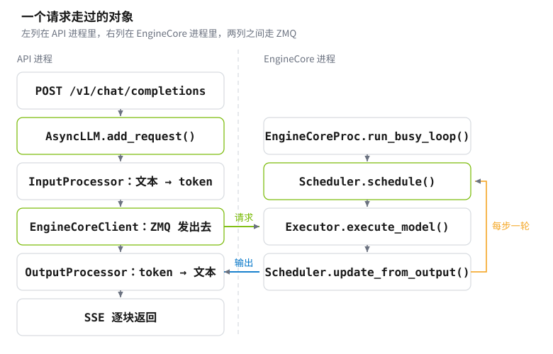

# Day 02 · 一个请求在 vLLM 里经历了什么

> **Phase** 1 · serving
> **日期** 2026-09-08 · **机器** Jetson AGX Thor · **耗时** ~2h

day 01 起的服务是个黑盒：`curl` 进去，token 出来。今天把它打开，跟着一条请求从 HTTP 进入，经过分词、排队、调度、前向、采样，再变回文本发出去。读的是 vLLM 0.22 的 v1 引擎源码，同时用服务自己报的指标验证每一段。

你会做这几件事：

- 找到源码在容器里的位置，读四个关键函数
- 画清楚请求路径：哪些步骤在 API 进程，哪些在引擎进程，中间怎么通信
- 用 `/metrics` 把一条请求拆成排队、prefill、decode 三段，各自量出毫秒数
- 观察引擎每一步处理多少 token，确认 prefill 和 decode 在调度器眼里是同一件事
- 发多条并发请求，看调度器如何决定这一轮算谁

结束时手上会有：一张请求路径图、三个能自己定位的类名、一条请求的分段耗时。

## 1. 为什么要学这个

day 03 到 day 06 都要改这个服务的行为：算 KV cache 占用、加并发看吞吐、找可用工作点。改之前得知道每个数字由谁产生。KV cache 由 `KVCacheManager` 分配，并发上限由 `Scheduler` 执行，延迟分成几段也是引擎内部的分工决定的。读一遍主循环，后面几天的实验才有解释的落点。

## 2. 背景

### 2.1 两个进程，一条 ZMQ 通道

v1 引擎把工作分给两个进程。API 进程处理 HTTP、分词、按模型自带的 chat template 把对话拼成 token 序列（day 00 §2.10）、把生成的 token 变回文本；引擎进程只做一件事，循环调度和前向。

分开的理由是 Python 的**全局解释器锁**（global interpreter lock，简称 GIL）：同一个 Python 进程里，任意时刻只有一个线程在执行字节码。HTTP 解析、分词、把每个 token 编成一条 **SSE**（server-sent events，服务器推送事件，day 01 §3.5 用它测过 TTFT）都是 CPU 活，和引擎主循环放在同一个解释器里就会互相抢这把锁，GPU 因此空等。分成两个进程之后各有各的解释器和锁，引擎那一侧只剩下调度和前向。

代价是两个进程之间要传消息，而且传得很频繁：每生成一个 token 都要回传一次。vLLM 用的是 **ZeroMQ**（简称 ZMQ）：一个消息传递库，提供请求应答、发布订阅这类通信模式，在同一台机器上走 Unix 域套接字或共享内存，不经过网络协议栈。选它而不是 Python 自带的 `multiprocessing.Queue`，是因为后者每条消息都要 pickle 一次，而 pickle 慢且不安全。消息的编码用的是 **msgspec**，一个按预先声明的结构做序列化的库，省掉了 pickle 的类型推断。

这些细节今天不需要深究。要记住的是：**每个 token 都要跨一次进程边界**，所以这条通道的开销直接落在 §4 量到的 token 间隔上。

<picture>
  <source media="(prefers-color-scheme: dark)" srcset="../../site_src/assets/fig-request-path-dark.svg">
  
</picture>

### 2.2 三个关键的类

读源码时先认这三个，其余都是它们的辅助。

| 类 | 文件 | 负责什么 |
|---|---|---|
| `AsyncLLM` | `vllm/v1/engine/async_llm.py` | API 进程这一侧的入口。每条请求在这里拿到一个输出队列，后台任务把引擎返回的 token 放进队列 |
| `EngineCore` | `vllm/v1/engine/core.py` | 引擎主循环。`step()` 一次做三件事：调度、执行、回写 |
| `Scheduler` | `vllm/v1/core/sched/scheduler.py` | 每一步决定算哪些请求、各算几个 token，并向 `KVCacheManager` 要块 |

另外两个会反复出现：`Request`（`vllm/v1/request.py`）是引擎里一条请求的全部状态；`OutputProcessor`（`vllm/v1/engine/output_processor.py`）把 token id 变回文本并判断停止条件。

### 2.3 主循环：`EngineCore.step()`

主循环的正体只有十几行，结构一目了然：

[vllm/v1/engine/core.py](https://github.com/vllm-project/vllm/blob/v0.22.1/vllm/v1/engine/core.py#L428-L457)
```python
def step(self) -> tuple[dict[int, EngineCoreOutputs], bool]:
    if not self.scheduler.has_requests():
        return {}, False
    scheduler_output = self.scheduler.schedule()
    future = self.model_executor.execute_model(scheduler_output, non_block=True)
    grammar_output = self.scheduler.get_grammar_bitmask(scheduler_output)
    model_output = future.result()
    if model_output is None:
        model_output = self.model_executor.sample_tokens(grammar_output)
    engine_core_outputs = self.scheduler.update_from_output(scheduler_output, model_output)
    return engine_core_outputs, scheduler_output.total_num_scheduled_tokens > 0
```

三步各自的职责：

1. `schedule()` 产出一个 `SchedulerOutput`：这一轮有哪些请求、每条算多少个 token、各自的 KV 块在哪。
2. `execute_model()` 把这些信息交给 worker，也就是真正持有模型权重、在 GPU 上跑前向的那个进程。它先返回一个 future，即「结果还没算完，先给你一个凭证，用 `.result()` 去取」。中间那行 `get_grammar_bitmask` 就是趁 GPU 在算时做的 CPU 活，只有约束解码时才用得上。
3. `update_from_output()` 把采样出的 token 追加到各条请求上，判断谁结束了，产出要发回 API 进程的输出。

外层的 `run_busy_loop()` 只是反复调用 `step()`，并在没有请求时阻塞等待新请求。

### 2.4 调度器眼里没有 prefill 和 decode

[vllm/v1/core/sched/scheduler.py](https://github.com/vllm-project/vllm/blob/v0.22.1/vllm/v1/core/sched/scheduler.py#L329-L340) 开头的注释直接说明了它的模型：

> There's no "decoding phase" nor "prefill phase" in the scheduler. Each request just has the `num_computed_tokens` and `num_tokens_with_spec`.

每条请求带两个数：已经算过多少个 token，一共需要算到多少。调度器每一步的工作就是给各请求分配一些 token 配额，让前者追上后者。

这个写法把几种情况统一了。刚到达的请求已算 0 个、需要算 20 个，于是这一步给它 20 个，这就是 prefill。已经在生成的请求每步只差 1 个，于是给它 1 个，这就是 decode。提示很长而配额不够时，这一步只给一部分，下一步继续，这就是分块预填充（chunked prefill）。三种情况在代码里是同一条路径。

配额来自 `token_budget = self.max_num_scheduled_tokens`。调度器先遍历 `running` 队列，再从 `waiting` 队列取新请求，每分配一条就从预算里扣掉。预算耗尽或 KV 块不够时，这一轮就到此为止。

### 2.5 KV 块不够时会抢占

从 `waiting` 取出一条请求，要先向 `KVCacheManager` 申请块（`allocate_slots`）。申请不到时，调度器不会让新请求插队，而是从 `running` 队列尾部往回抢占（`_preempt_request`）：把某条请求的块全部释放，状态改回 `PREEMPTED`，它之前算过的 token 作废，之后重新排队从头 prefill。

被抢占的次数记在 `vllm:num_preemptions_total` 里。这个数不为零，说明 KV cache 相对负载太小，day 03 会把这条关系算清楚。

### 2.6 一条请求的状态机

`RequestStatus`（`vllm/v1/request.py`）列出了全部状态。主要的几个：

| 状态 | 含义 |
|---|---|
| `WAITING` | 已进入引擎，还没被调度过 |
| `RUNNING` | 正在被调度，每步分到一些 token |
| `PREEMPTED` | 被抢占，块已释放，重新排队 |
| `FINISHED_STOPPED` | 遇到结束符或停止字符串 |
| `FINISHED_LENGTH_CAPPED` | 到达 `max_tokens` 或模型长度上限 |
| `FINISHED_ABORTED` | 客户端断开或显式取消 |

枚举里有一行注释值得注意：`PREEMPTED` 之后的所有值都算「已结束」，判断函数就是 `status > RequestStatus.PREEMPTED` 一个比较。所以往这个枚举中间插值会改变语义。

## 3. 动手

### 3.0 前置

用 day 01 的脚本起一个服务即可。本节换成一个 0.8B 的小模型，理由是请求路径与模型大小无关，小模型启动快、显存占用低，一台机器上可以和别的服务并存。显存充裕时直接用 day 01 那个 9B 服务也一样，各段的绝对值会变大，比例关系不变。

```bash
MODEL=Qwen/Qwen3.5-0.8B PORT=8100 UTIL=0.04 MAXLEN=2048 MAXSEQS=8 LORA= NAME=t2t-vllm-day02 \
    bash ../day01_vllm-first-serve/code/serve.sh
until curl -sf localhost:8100/health >/dev/null; do sleep 5; done && echo 就绪
```

`MODEL` 有两种写法。一种是 Hugging Face 上的仓库名，形如 `组织名/模型名`，上面用的 `Qwen/Qwen3.5-0.8B` 就是；权重不在本地时会自动下载到 `~/.cache/huggingface`。另一种是本地目录的绝对路径，适合已经下好或者机器不能联网的情况。用路径时注意它必须在挂进容器的目录下面，否则容器里看不到（§5 第 3 条）。

其余参数：`LORA=` 表示不挂 adapter；`MAXSEQS=8` 把同时处理的请求数限制到 8，§3.3 要靠它才看得到排队；`NAME` 换一个，免得覆盖 day 01 的容器。

### 3.1 找到源码

源码在容器里，不用另外 clone：

```bash
sudo docker exec t2t-vllm-day02 python3 -c "import vllm, pathlib; print(pathlib.Path(vllm.__file__).parent)"
# /usr/local/lib/python3.12/dist-packages/vllm

sudo docker exec t2t-vllm-day02 sed -n '428,460p' \
    /usr/local/lib/python3.12/dist-packages/vllm/v1/engine/core.py
```

要在本机编辑器里读，就把这几个文件复制出来：

```bash
sudo docker cp t2t-vllm-day02:/usr/local/lib/python3.12/dist-packages/vllm/v1 ./vllm-v1
```

§2 引用的行号对应 vLLM 0.22.1，换版本会变，用函数名搜索更稳。

### 3.2 把一条请求拆成三段

`code/trace_one.py` 发一条请求，在请求前后各抓一次 `/metrics`，相减得到这一条的值。vLLM 的指标按 **Prometheus** 的文本格式暴露：一行一个指标，值是进程启动以来的累计量，只增不减。其中一类叫**直方图**（histogram），它不存每次的原始值，只维护若干个区间的计数，外加一个总和 `_sum` 和一个总次数 `_count`。所以单条请求的值取不到，但两次快照的和之差除以次数之差，就是这期间那几条请求的平均值。只发一条请求时，这个平均值就是它本身。

请求里的 `model` 字段必须和服务端认的名字完全一致，而那个名字就是启动时 `MODEL` 的值。不确定时问服务要：

```bash
curl -s localhost:8100/v1/models | python3 -c 'import json,sys; print(json.load(sys.stdin)["data"][0]["id"])'
# Qwen/Qwen3.5-0.8B

python3 code/trace_one.py --url http://localhost:8100 --model Qwen/Qwen3.5-0.8B --max-tokens 64
```

核心是这几行：

[days/day02_vllm-request-path/code/trace_one.py](https://github.com/enkerewpo/tokens-to-torque/blob/main/days/day02_vllm-request-path/code/trace_one.py#L35-L50)
```python
def scrape(url):
    with urllib.request.urlopen(f"{url}/metrics", timeout=10) as r:
        text = r.read().decode()
    out = {}
    for line in text.splitlines():
        m = re.match(r"([a-z_:]+(?:_sum|_count|_total)?)(\{[^}]*\})?\s+([0-9.eE+-]+)$", line)
        ...
```

要注意的是单位。`vllm:iteration_tokens_total` 名字里有 `_total`，但它是直方图，值是每一步处理的 token 数，不是时间。脚本按指标分别标了单位，否则会把 1.31 个 token 打印成 1310 毫秒。

### 3.3 看调度器怎么排

`code/watch_sched.py` 同时发 N 条请求，每 100 毫秒读一次两个瞬时值：`vllm:num_requests_running` 和 `vllm:num_requests_waiting`。这两个数直接来自调度器的两个队列长度。

```bash
python3 code/watch_sched.py --url http://localhost:8100 --model Qwen/Qwen3.5-0.8B -n 12 --max-tokens 96
```

采样在主线程，请求在后台线程，输出是一条时间线。想看到排队，就把服务的并发上限调小：`MAXSEQS=4 bash ../day01_vllm-first-serve/code/serve.sh`。

### 3.4 停

```bash
bash ../day01_vllm-first-serve/code/stop.sh    # 或 NAME=t2t-vllm-day02 时用 docker stop
```

## 4. 结果

Jetson AGX Thor（120 W），vLLM 0.22.1（NGC `26.06-py3` 容器），Qwen3.5-0.8B bf16，`--max-model-len 2048 --gpu-memory-utilization 0.04 --max-num-seqs 8`。

启动日志里的四个数：

| | 值 |
|---|---|
| 权重加载 | 1.72 GiB，1.10 s |
| torch.compile | 43.8 s |
| KV cache | 2.2 GiB，102 985 token |
| 每条请求占满 2048 token 时的最大并发 | 50× |

一条请求（提示 20 个 token，生成 64 个）的分段，来自 `code/trace_one.py`：

| 指标 | 值 | 对应路径上的哪一步 |
|---|---|---|
| `request_queue_time_seconds` | 9.0 µs | 进 `waiting` 到第一次被 `schedule()` 选中 |
| `request_prefill_time_seconds` | 28.2 ms | 提示一次算完 |
| `time_to_first_token_seconds` | 32.6 ms | 客户端看到第一个 token |
| `request_decode_time_seconds` | 685.3 ms | 第一个 token 到最后一个 |
| `request_inference_time_seconds` | 713.5 ms | prefill + decode |
| `inter_token_latency_seconds` | 10.9 ms | 相邻两个 token 的间隔 |
| 客户端量到的端到端 | 719.2 ms | 含 HTTP 和 SSE 的开销 |
| `num_preemptions_total` | 0 | 没有发生抢占 |

服务空闲时排队时间是 9 微秒，也就是从 `add_request` 到被下一轮 `schedule()` 选中的间隔。这个量级说明请求几乎是立刻进入批次的，主循环没有额外的等待窗口。decode 占了总时间的 96%，与 day 01 §2.3 的结论一致：生成越长，TPOT 越主导。

`vllm:iteration_tokens_total` 的平均值是 **1.31 个 token**。这个数把 §2.4 说的调度模型验证了：一次 prefill 步处理 20 个 token，之后 64 步各处理 1 个，$(20 + 64) / 65 = 1.29$，与实测相符。引擎绝大多数步只算一个 token，这正是 decode 阶段受内存带宽限制的原因。

### 12 条请求撞上 8 个位置

`--max-num-seqs 8` 时同时发 12 条，每条最多 96 个 token（`code/watch_sched.py`，每 100 毫秒采样一次）：

```text
  时刻 (s)   在跑   在等
    3.03    8    4  ████████····
    4.19    8    4  ████████····
    4.29    1    3  █···
    4.40    4    0  ████
    5.35    4    0  ████
```

前 8 条一起进入批次，后 4 条留在 `waiting` 队列里。4.29 秒时前 8 条同时结束，调度器在下一轮就把等待的 4 条全部放进来。各条的端到端时间因此分成两档：

| | 端到端 |
|---|---|
| 先进入的 8 条 | 4.23 到 4.26 s |
| 排队的 4 条 | 5.42 到 5.44 s |

第二批比第一批多花的 1.18 秒，就是它们在队列里等的时间。同一批内部的 8 条相差不到 30 毫秒，因为它们每一步都被放进同一个批次，同步前进。

这里也能看出 `max_num_seqs` 和 KV cache 是两个独立的限制。缓存能装 102 985 个 token，12 条请求最多用 12 × 2048 ≈ 24 600 个，远没到上限，排队完全是并发数上限造成的。day 04 会把这两个限制分开扫。

## 5. 踩坑

1. **`--gpu-memory-utilization` 是按设备总量算的，不是按当前空闲量。** 这个比例乘的是设备内存总量，而 vLLM 启动时会拿当前空闲量和它相比，不够就直接退出。所以同一个值在空机器上能用，在跑着别的任务的机器上会失败。另一种失败更隐蔽：比例够得着，但扣掉权重、激活值和 CUDA graph 之后 KV cache 剩下负数。两条报错分别长这样：

   ```text
   Available KV cache memory: -1.14 GiB
   Free memory on device cuda:0 (6.63/122.83 GiB) on startup is less than
   desired GPU memory utilization (0.06, 7.37 GiB).
   ```

   第二种的应对是把 `--max-num-seqs` 和 `--max-model-len` 调小：显存探测按这两个值构造最大批次，调小之后同样的比例能留出更多 KV cache。

2. **`serve.sh` 里 `LORA=` 原来不生效。** 脚本写的是 `${LORA:-默认路径}`，这个写法在变量为空时也会落回默认值，于是显式写 `LORA=` 仍然会去挂 day 00 的 adapter，而那个路径在别的机器上不存在，服务直接起不来。改成 `${LORA-默认路径}`（少一个冒号）之后，只有完全不设这个变量才用默认值。
3. **模型目录必须在挂进容器的路径下。** 把权重放在 `~/models/` 下、用绝对路径传给 `vllm serve`，容器里看不到这个目录，vLLM 会把它当成 Hugging Face 仓库名，报 `Repo id must be in the form 'repo_name' or 'namespace/repo_name'`。放进已经挂载的缓存目录即可。
4. **名字里有 `_total` 的不一定是计数器。** `vllm:iteration_tokens_total` 是直方图，单位是 token 数。按时间打印会得到「1310 毫秒」这种数字，看起来还挺合理，所以特别容易错。判断方法是看 `/metrics` 里有没有对应的 `_bucket` 行。
5. **容器的网络和宿主机不是一回事。** 宿主机能访问 Hugging Face，不代表容器里也能：桥接网络的出口不同，而写在容器环境变量里的代理地址如果是 `127.0.0.1`，在容器里指的是容器自己，连接会被直接拒绝。可靠的做法是权重先下载到宿主机，再通过挂载给容器用，并加上 `HF_HUB_OFFLINE=1` 让它在缺文件时立刻报错而不是反复重试。
6. **指标要等请求结束后才写入。** 请求返回和指标更新之间有一小段延迟，紧接着抓 `/metrics` 会拿到旧值，导致差值为零。脚本里等了 0.5 秒。
7. **打印精度会造出假的零。** 排队时间的真实值是 9 微秒，脚本最初一律按毫秒保留一位小数，于是显示成 `0.0 ms`，看起来像这一段根本没发生。凡是跨几个数量级的时间量，要么按值切换单位，要么直接打印原始秒数。

## 6. 延伸

- vLLM 的 [V1 架构设计文档](https://docs.vllm.ai/en/latest/design/arch_overview.html)，看完源码再读一遍，能确认自己没有理解偏。
- 想看调度器的完整决策过程，把日志级别调到 DEBUG：`-e VLLM_LOGGING_LEVEL=DEBUG`。输出很多，建议只在单条请求时开。

day 03 要回答的问题：启动日志报的 102 985 个 token 是怎么算出来的？改 `--max-model-len` 和 `--gpu-memory-utilization` 各取三组，手算的容量和实测差多少？
