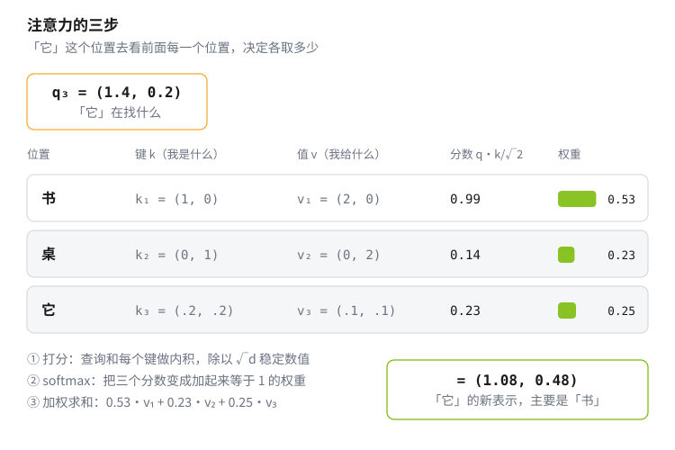
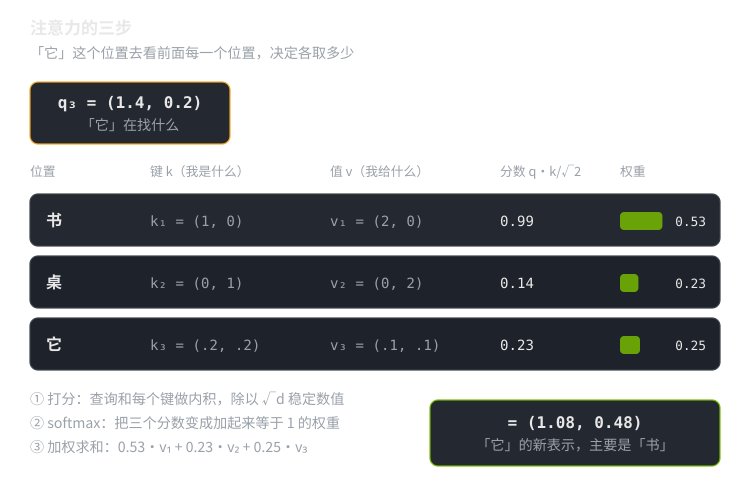
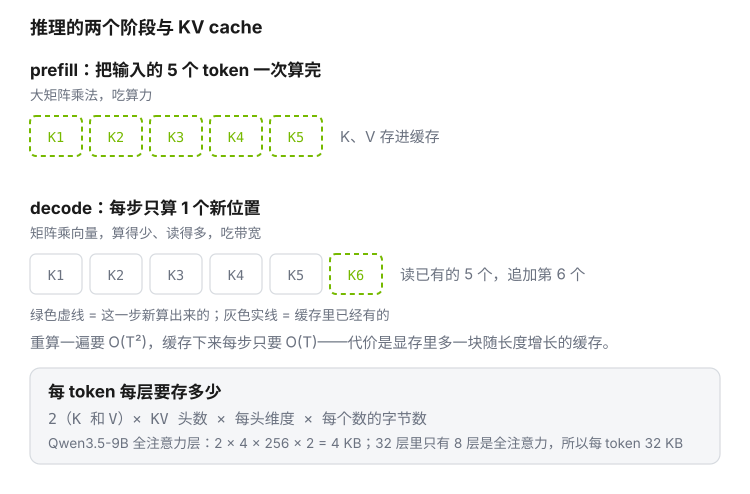
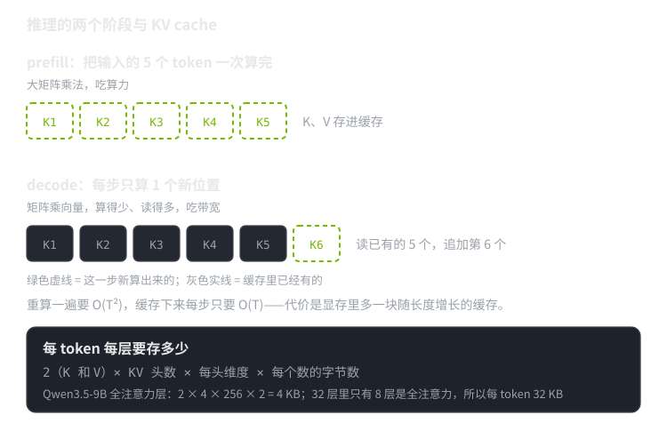

这一页把课表里反复出现的那块模型知识从头讲一遍：一个语言模型收到什么、吐出什么，中间那 32 层里到底在算什么，以及为什么推理时要有 KV cache。**不读这一页也能跑通 Day 00**——那天只需要知道“模型里有一堆矩阵，LoRA 给每个矩阵挂一对小矩阵”。但从 day 02 起，serving、CUDA、训练三条线都会不断回到这里。

概念按依赖顺序排：前一节是后一节的前提，从头读下来不会遇到没定义过的词。所有具体数字都用课表里那个模型（Qwen3.5-9B），这样和 [Day 00](../days/day00_lora-quickstart/README.md) 的实测对得上。

## D.0 读之前需要什么

真正卡人的前置只有四条，每条都能在这个仓库里补：

| 需要什么 | 用在哪 | 去哪补 |
|---|---|---|
| 矩阵乘向量、矩阵形状怎么对齐 | 全篇 | [附录 A](linear-algebra.md) §A.1–A.3 |
| 梯度下降、Adam 在存什么 | D.1 的训练目标；显存账 | [附录 B](optimizers.md) |
| fp32 / bf16 各占几个字节 | KV cache 和显存的所有估算 | [附录 C](numeric-formats.md) |
| softmax 与交叉熵 | D.1、D.3 | 下面 D.1 直接讲 |

不需要先学的：卷积网络、RNN/LSTM、强化学习。它们和这门课的主线没有依赖关系，等 Phase 5 讲 VLA 时再按需补。

会读一点 PyTorch 有帮助，但只需要认得 `nn.Linear(d_in, d_out)` 是“一次矩阵乘法（外加一个可选的偏置）”，以及 `forward()` 是数据流过模块的顺序。

## D.1 语言模型在做的唯一一件事

**定义（token 与词表）。** 一段文本先被切成一串整数，每个整数叫一个 **token**，取值范围是 $\{0,1,\dots,V-1\}$，$V$ 叫**词表大小**。Qwen3.5-9B 的 $V = 248320$。切分规则由分词器（tokenizer）决定，它是模型的一部分，不能换。

**定义（语言模型）。** 给定前 $t$ 个 token $x_1,\dots,x_t$，模型输出一个长度为 $V$ 的向量 $\mathbf{z}\in\mathbb{R}^V$，叫 **logits**；每个分量是“下一个 token 是这个词”的分数。把分数变成概率用 **softmax**：

$$
p_i = \frac{e^{z_i}}{\sum_{j=1}^{V} e^{z_j}},\qquad i = 1,\dots,V
$$

softmax 做两件事：指数保证结果为正，除以总和保证加起来等于 1。于是 $\mathbf{p}$ 是词表上的一个概率分布。

**训练目标。** 训练数据给出了真实的下一个 token $y$，损失取它的负对数概率，叫**交叉熵**：

$$
\mathcal{L} = -\log p_y
$$

猜得越准（$p_y$ 越接近 1），损失越接近 0；$p_y$ 接近 0 时损失趋于无穷。整条样本的损失是各位置损失的平均——[Day 00 §3.3](../days/day00_lora-quickstart/README.md) 里那个只在回答位置上算损失的掩码，掩的就是这个平均。

**推理。** 拿到 $\mathbf{p}$ 之后按它采样出下一个 token，接到输入末尾，再算一次。**每生成一个 token，整个模型就从头到尾跑一遍**——这句话是后面所有性能讨论的起点。

::: {.callout-note title="温度和 top-p 是什么"}
采样前通常先把 logits 除以一个数 $T$（**温度**）再做 softmax。$T < 1$ 让分布更尖（更保守），$T > 1$ 更平（更随机），$T \to 0$ 等价于永远取最大的那个。**top-p**（核采样）则是先把概率从大到小排序，只保留累计概率刚超过 $p$ 的那一批候选，其余置零后重新归一化。Day 00 的 `chat.py` 用的是 $T = 0.7$、$p = 0.9$。
:::

## D.2 每个位置一个向量

模型内部不直接处理整数。第一步是查表：一个 $V \times d$ 的矩阵（`embed_tokens`）把每个 token id 映射成一个 $d$ 维向量，$d$ 叫**隐藏维度**（Qwen3.5-9B 的 $d = 4096$）。

于是长度为 $T$ 的输入变成一个 $T \times d$ 的矩阵：**每一行是一个位置的当前表示**。接下来 32 个块做的事，都是在改这 $T$ 行向量；形状自始至终是 $T \times d$，不变。

每个块的写法都是“算点东西，加回去”：

$$
\mathbf{h} \leftarrow \mathbf{h} + \text{某个模块}(\mathbf{h})
$$

这个加法叫**残差连接**。它带来两个好处：模块只需要学“该在原表示上补什么”，不必重新表达整个向量；反向传播时梯度可以顺着加法直接回到浅层，几十层的网络才训得动[^resnet]。

## D.3 注意力：让不同位置交换信息

到这里为止，每个位置各算各的，谁也不知道别人是什么。注意力就是负责交换的那一步。

### 先看它要解决的问题

> 小明把书放在桌上，然后他打开了**它**。

读到「它」的时候，模型要把「书」的信息取过来。难点在于：**该取谁，取决于内容，不取决于位置**——「它」不总是指前面第 5 个词。所以需要一种“按内容去找”的机制。

### 三个角色

关键的一步是：**同一个位置的向量，乘三个不同的矩阵，扮演三个不同角色**。

| 角色 | 怎么来的 | 意思 |
|---|---|---|
| **K**（键，key） | $\mathbf{k}_j = \mathbf{x}_j W_K$ | 我是什么，挂出去给别人看 |
| **V**（值，value） | $\mathbf{v}_j = \mathbf{x}_j W_V$ | 如果你选中我，我给你什么内容 |
| **Q**（查询，query） | $\mathbf{q}_i = \mathbf{x}_i W_Q$ | 我在找什么 |

在上面那句话里：「它」这个位置发出的查询大意是“我在找一个能被打开的、前面提过的东西”；「书」的键大意是“我是个可被指代的物件”。两者对得上，于是「它」把「书」的**值**取过来。

**为什么非要三个、不能只用一个向量。** 如果直接拿两个位置的表示做内积，衡量的是“谁和我像”。但这里需要的是“谁能回答我的问题”——问句和答案本来就不像。$W_Q$ 和 $W_K$ 的存在，就是让模型自己学出“什么样的提问该配什么样的应答”。$W_V$ 再单独一个，是因为“凭什么被选中”和“被选中后交出什么”也不是一回事。

### 一个能手算的例子

取 3 个 token、每个头 2 维（真实模型是 256 维，道理一样）。设第 3 个位置（「它」）的查询和三个位置的键、值分别是：

$$
\mathbf{q}_3 = (1.4,\ 0.2),\qquad
\begin{aligned}
\mathbf{k}_1 &= (1,\ 0) \\ \mathbf{k}_2 &= (0,\ 1) \\ \mathbf{k}_3 &= (0.2,\ 0.2)
\end{aligned}
\qquad
\begin{aligned}
\mathbf{v}_1 &= (2,\ 0) \\ \mathbf{v}_2 &= (0,\ 2) \\ \mathbf{v}_3 &= (0.1,\ 0.1)
\end{aligned}
$$

**第一步，打分。** 查询和每个键做内积，再除以 $\sqrt{d_k} = \sqrt{2} \approx 1.414$：

$$
\frac{\mathbf{q}_3\cdot\mathbf{k}_1}{\sqrt 2} = \frac{1.4}{1.414} = 0.99,\qquad
\frac{\mathbf{q}_3\cdot\mathbf{k}_2}{\sqrt 2} = \frac{0.2}{1.414} = 0.14,\qquad
\frac{\mathbf{q}_3\cdot\mathbf{k}_3}{\sqrt 2} = \frac{0.32}{1.414} = 0.23
$$

**第二步，softmax 变权重。** 按 D.1 的公式：$e^{0.99}=2.69$、$e^{0.14}=1.15$、$e^{0.23}=1.25$，总和 5.10，于是

$$
w = (0.53,\ 0.23,\ 0.25),\qquad w_1 + w_2 + w_3 = 1
$$

**第三步，按权重取值。**

$$
0.53\,\mathbf{v}_1 + 0.23\,\mathbf{v}_2 + 0.25\,\mathbf{v}_3 = (1.08,\ 0.48)
$$

结果被 $\mathbf{v}_1$ 主导——「它」这个位置的新表示里，装的主要是「书」的内容。**这就是注意力的全部。** 后面所有的公式和优化，都是这三步的高效批量版本。

{.fig .lightbox .light-content fig-alt="注意力三步：查询与每个键做内积得到分数，softmax 变成和为一的权重，再按权重把各位置的值加权求和"}
{.fig .lightbox .dark-content fig-alt="注意力三步：查询与每个键做内积得到分数，softmax 变成和为一的权重，再按权重把各位置的值加权求和"}

### 写成矩阵

把所有位置的查询、键、值各自堆成矩阵 $Q, K, V$（每行一个位置），上面三步就是一个式子[^attn]：

$$
\text{Attention}(Q,K,V) = \operatorname{softmax}\!\left(\frac{QK^{\top}}{\sqrt{d_k}} + M\right)V
$$

逐项对上面的例子：$QK^{\top}$ 是一个 $T\times T$ 的分数矩阵，第 $i$ 行第 $j$ 列就是“位置 $i$ 的查询 · 位置 $j$ 的键”；softmax 逐行做，把每一行变成和为 1 的权重；乘 $V$ 就是逐行的加权求和。

**为什么除以 $\sqrt{d_k}$。** 两个 $d_k$ 维随机向量的内积，方差随 $d_k$ 线性增长。$d_k = 256$ 时分数动辄几十，softmax 会尖锐到几乎只剩一个非零权重，梯度趋近于零。除以 $\sqrt{d_k}$ 把方差拉回常数量级（原论文[^attn] §3.2.1）。

**$M$ 是因果掩码。** 生成任务里位置 $i$ 只能看 $j \le i$：令 $M_{ij} = -\infty$（当 $j > i$），softmax 之后这些位置的权重正好是 0。所以真实的权重矩阵是下三角的。

### 多头

不会只做一次。把 $d$ 维切成 $h$ 份，每份 $d_k = d/h$ 维，各自独立做一遍上面三步，再把结果拼回 $d$ 维、过一个输出矩阵 $W_O$。每一份叫一个**头**。直观上不同的头可以盯不同的关系——有的盯指代，有的盯句法——但这是设计动机和事后观察，不是定理（原论文 §3.2.2）。

Qwen3.5-9B 的全注意力层是 16 个查询头，每头 256 维，$16 \times 256 = 4096$ 正好是 $d$。

### 代价

那个 $T\times T$ 的分数矩阵是关键：**序列长度翻倍，注意力的计算量变四倍**。长上下文贵就贵在这里，后面一整条优化线（D.8）都在跟它较劲。

**分组查询注意力（GQA）。** 让多个查询头共用一组 $K$、$V$[^gqa]。Qwen3.5-9B 是 16 个查询头配 4 组 KV，每头 256 维——查询还是 16 份，但要存下来的键值只有四分之一。省的是什么见 D.7。

## D.4 前馈网络：每个位置各自变换

交换完信息，每个位置再各自过一个两层的小网络，叫**前馈网络**（FFN）。经典写法是 $\max(0, xW_1)W_2$；现在常用的是 **SwiGLU**[^glu]：

$$
\text{FFN}(x) = \big(\operatorname{SiLU}(xW_{\text{gate}}) \odot xW_{\text{up}}\big)W_{\text{down}},
\qquad \operatorname{SiLU}(z) = z\,\sigma(z)
$$

$\odot$ 是逐元素相乘，$\sigma$ 是 sigmoid。两条并行的线性变换，一条经过 SiLU 之后当作“门”去缩放另一条，再投回 $d$ 维。中间那个维度（Qwen3.5-9B 是 12288，即 $3d$）叫 FFN 中间维。

**这里是参数最多的地方。** 一层 FFN 有 $3 \times 4096 \times 12288 = 150\,994\,944$ 个参数，而一层全注意力的四个矩阵加起来只有 $58\,720\,256$ 个。整个模型的参数量可以这样加出来：

| 部分 | 每个多少参数 | 个数 | 小计 |
|---|---|---|---|
| `embed_tokens` | $248320 \times 4096$ | 1 | 1 017 118 720 |
| 全注意力块（注意力 + FFN） | 58 720 256 + 150 994 944 | 8 | 1 677 721 600 |
| 线性注意力块（mixer + FFN） | 67 371 008 + 150 994 944 | 24 | 5 240 782 848 |
| `lm_head` | $4096 \times 248320$ | 1 | 1 017 118 720 |
| **合计** | | | **8 952 741 888** |

模型自己报的是 8 997 081 600，差 44 M，其中 43.3 M 是 Day 00 挂上去的 LoRA 参数，剩下约 1 M 是各处的归一化权重和线性注意力里的一维卷积——这些模块每个只有几千个参数，但它们不是矩阵乘法，LoRA 挂不上去。

## D.5 归一化：让每层拿到的数值范围稳定

每个模块之前会先做一次归一化。**LayerNorm** 减均值除标准差再缩放；**RMSNorm** 省掉减均值这一步[^rmsnorm]：

$$
\text{RMSNorm}(\mathbf{x}) = \frac{\mathbf{x}}{\sqrt{\frac{1}{d}\sum_{i=1}^{d} x_i^2 + \epsilon}} \odot \mathbf{g}
$$

$\mathbf{g}\in\mathbb{R}^d$ 是可学习的缩放向量，$\epsilon$ 防止除零。少一步减均值，省一点计算，效果基本不变——现在的大模型基本都用它。

**放在模块之前还是之后**（pre-norm / post-norm）不是小事：原论文是 post-norm，需要小心的学习率预热才能收敛；pre-norm 把归一化挪到残差分支里面，训练稳定得多，现在几乎都用 pre-norm[^prenorm]。这就是 [Day 00 §2.9](../days/day00_lora-quickstart/README.md) 那张块结构图里，归一化画在 mixer 和 FFN **前面**的原因。

## D.6 位置信息：RoPE

注意力的公式里没有任何地方用到“第几个位置”——把输入的行打乱，输出也只是跟着打乱。所以位置必须显式喂进去。

现在的主流做法是 **RoPE**（旋转位置编码）[^rope]：把 $Q$、$K$ 的每两维看成一个复数（平面上的一个向量），按位置 $m$ 旋转一个角度 $m\theta$。这样两个位置的内积只依赖它们的**相对距离**，而不是绝对位置。它不增加参数，也不改变形状，只是在算注意力之前对 $Q$、$K$ 各做一次旋转。

推导见原论文 §3.4；这里只需要知道两件事：位置信息加在 $Q$、$K$ 上（不是加在输入 embedding 上），以及模型能处理多长的上下文由训练时见过的位置范围决定（Qwen3.5-9B 是 262144）。

## D.7 推理是两个阶段：prefill 与 decode

回到 D.1 的那句话：每生成一个 token，模型要从头跑一遍。如果每次都把整个前缀重算一遍，第 $n$ 个 token 就要算 $n$ 次注意力，总量随长度平方增长。

但注意到：位置 $j$ 的 $K_j$、$V_j$ 只依赖 $x_j$，**和后面生成什么无关**。所以算过一次就可以存起来，这就是 **KV cache**。于是推理分成两个阶段：

- **prefill**：把用户输入的 $T$ 个 token 一次性喂进去，算出所有位置的 K、V 存好，并产出第一个输出 token。这一步是计算密集的（大矩阵乘法）。
- **decode**：之后每一步只算**一个**新位置的 Q、K、V，读取缓存里已有的 K、V 做注意力，再把新的 K、V 追加进去。这一步是访存密集的（矩阵乘向量，算得少读得多）。

{.fig .lightbox .light-content fig-alt="prefill 一次算完整个输入的 K、V 并存进缓存；decode 每步只算一个新位置，读缓存做注意力再把新的 K、V 追加进去"}
{.fig .lightbox .dark-content fig-alt="prefill 一次算完整个输入的 K、V 并存进缓存；decode 每步只算一个新位置，读缓存做注意力再把新的 K、V 追加进去"}

**缓存要多大。** 每个 token、每层要存 K 和 V 各一份：

$$
\text{每 token 每层字节数} = 2 \times n_{\text{kv}} \times d_{\text{head}} \times \text{dtype 字节数}
$$

代入 Qwen3.5-9B 的全注意力层（$n_{\text{kv}} = 4$，$d_{\text{head}} = 256$，bf16 占 2 字节）：$2\times4\times256\times2 = 4096$ 字节 = 4 KB。这个模型 32 层里只有 8 层是全注意力，所以每个 token 一共 32 KB；1000 个 token 约 32 MB，跑满 262144 的上下文约 8.4 GB。

作为对照：如果 32 层全是标准多头注意力（16 组 KV），每 token 每层是 $2\times16\times256\times2 = 16$ KB，32 层就是 512 KB，**是前者的 16 倍**。GQA 和混合注意力省下的就是这个。day 03 会把这个公式和实测显存对上账。

（线性注意力层不存逐 token 的 K、V，它维持的是一个固定大小的状态，不随长度增长——这正是混合架构的动机。）

## D.8 后来的扩展与优化

上面是一个块的基本形态。工业上用的模型在此之上有一堆改动，每一条都在解决一个具体的瓶颈。下表按“解决什么问题”排，最后一列是课表里会动手做的地方。

| 改动 | 解决什么 | 代价 | 课表位置 |
|---|---|---|---|
| MQA / GQA[^mqa][^gqa] | KV cache 太大 | 表达能力略降 | day 03 |
| 滑窗 / 线性注意力 / 混合架构 | 长序列的 $T^2$ 和缓存增长 | 远距离信息可能丢 | day 03、本页 D.7 |
| FlashAttention[^flash] | 注意力的显存带宽瓶颈 | 实现复杂、依赖硬件 | day 20 |
| 连续批处理 + PagedAttention[^paged] | 吞吐低、缓存碎片 | 调度复杂度 | day 04 |
| 量化到 INT4 / NVFP4 | 权重和带宽 | 精度损失需要评测 | day 08、附录 C |
| 混合专家（MoE）[^moe] | 想要更多参数但不想更多计算 | 显存占用不降、路由不均衡 | day 07 |
| LoRA[^lora] | 全参微调显存放不下 | 只能表示低秩的更新 | day 00、day 31 |
| 投机解码[^spec] | decode 阶段一次只出一个 token | 需要一个草稿模型 | day 09 |

这张表不需要现在读懂，等做到对应那天回来看一眼就行。

## D.9 想再深入

- **代码路线**：Karpathy 的 [nanoGPT](https://github.com/karpathy/nanoGPT) 是最短的一条“看完能自己写一个”的路，约 300 行训练代码。day 26 会手敲一遍。
- **论文路线**：先读 Transformer 原论文[^attn] §3，再读 RoPE[^rope] §3、GQA[^gqa] §2，就够看懂现在大部分开源模型的结构了。

## 参考文献

[^attn]: Vaswani et al., *Attention Is All You Need*, NeurIPS 2017，§3.2 注意力定义、§3.2.1 缩放、§3.2.2 多头。[arXiv:1706.03762](https://arxiv.org/abs/1706.03762)
[^resnet]: He et al., *Deep Residual Learning for Image Recognition*, CVPR 2016，§3.1 残差学习的动机。[arXiv:1512.03385](https://arxiv.org/abs/1512.03385)
[^gqa]: Ainslie et al., *GQA: Training Generalized Multi-Query Transformer Models from Multi-Head Checkpoints*, EMNLP 2023，§2 方法与质量/速度权衡。[arXiv:2305.13245](https://arxiv.org/abs/2305.13245)
[^mqa]: Shazeer, *Fast Transformer Decoding: One Write-Head is All You Need*, 2019，§2 多查询注意力。[arXiv:1911.02150](https://arxiv.org/abs/1911.02150)
[^glu]: Shazeer, *GLU Variants Improve Transformer*, 2020，§2 SwiGLU 定义与实验。[arXiv:2002.05202](https://arxiv.org/abs/2002.05202)
[^rmsnorm]: Zhang & Sennrich, *Root Mean Square Layer Normalization*, NeurIPS 2019，§3 定义。[arXiv:1910.07467](https://arxiv.org/abs/1910.07467)
[^prenorm]: Xiong et al., *On Layer Normalization in the Transformer Architecture*, ICML 2020，§3 pre-norm 与 post-norm 的梯度分析。[arXiv:2002.04745](https://arxiv.org/abs/2002.04745)
[^rope]: Su et al., *RoFormer: Enhanced Transformer with Rotary Position Embedding*, 2021，§3.4 旋转位置编码。[arXiv:2104.09864](https://arxiv.org/abs/2104.09864)
[^flash]: Dao et al., *FlashAttention: Fast and Memory-Efficient Exact Attention with IO-Awareness*, NeurIPS 2022，§3 分块与重算。[arXiv:2205.14135](https://arxiv.org/abs/2205.14135)
[^paged]: Kwon et al., *Efficient Memory Management for Large Language Model Serving with PagedAttention*, SOSP 2023，§4 PagedAttention。[arXiv:2309.06180](https://arxiv.org/abs/2309.06180)
[^moe]: Fedus et al., *Switch Transformers: Scaling to Trillion Parameter Models with Simple and Efficient Sparsity*, JMLR 2022，§2 路由。[arXiv:2101.03961](https://arxiv.org/abs/2101.03961)
[^lora]: Hu et al., *LoRA: Low-Rank Adaptation of Large Language Models*, ICLR 2022，§4 方法。[arXiv:2106.09685](https://arxiv.org/abs/2106.09685)
[^spec]: Leviathan et al., *Fast Inference from Transformers via Speculative Decoding*, ICML 2023，§2 算法与接受率。[arXiv:2211.17192](https://arxiv.org/abs/2211.17192)
